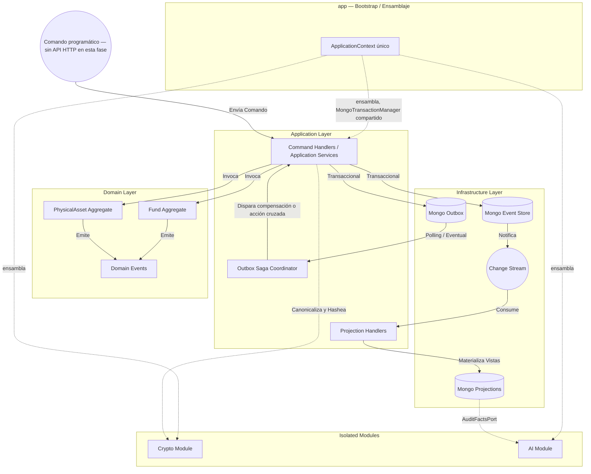
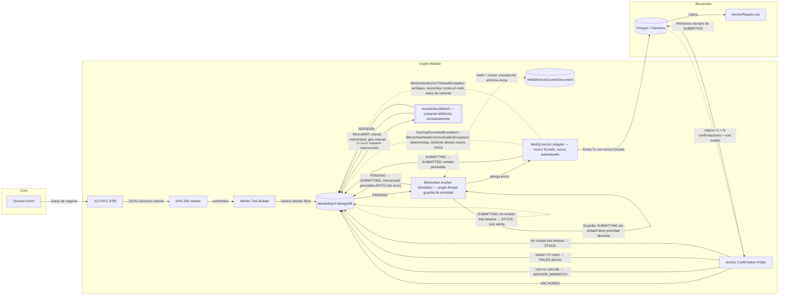
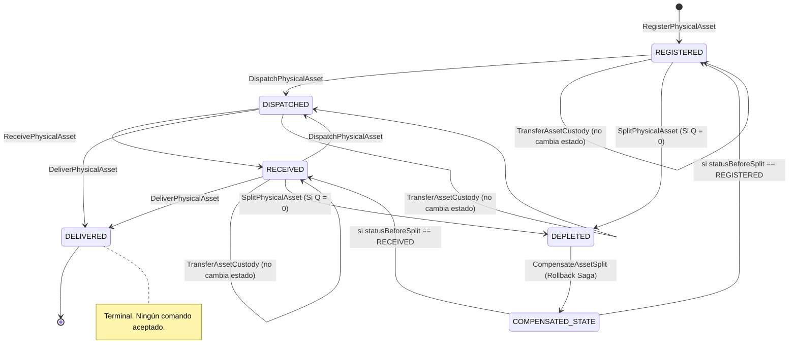

# Diagramas de Arquitectura — Sistema "PaxFide" (Fase 2 Completada)

A continuación, se presentan los diagramas que detallan la arquitectura implementada y verificada durante la Fase 2.

## 1. Arquitectura General y Flujo de Event Sourcing / CQRS

Este diagrama muestra el flujo desde la ingesta de un comando hasta la persistencia inmutable y su eventual materialización en las proyecciones y auditorías.

> **Nota:** no existe todavía capa HTTP/API expuesta (Fase 3, sin definir formalmente). El "Comando" de entrada hoy es programático — la Tarea 14 (`app`) ensambla `core`, `crypto` y `ai` en un único `ApplicationContext`, verificado con un smoke test transaccional real, pero sin ningún endpoint público todavía.

---

## 2. Pipeline Criptográfico y Anclaje en Blockchain (Web3j)

Este diagrama detalla cómo los eventos de dominio se transforman en una cadena inmutable y se anclan en Polygon/Ganache usando árboles de Merkle. La máquina de estados del anclaje sigue ADR-019 en su totalidad — no se simplifica.

**Estados terminales/intermedios del `MerkleBatch`:** `PENDING → SUBMITTING → SUBMITTED → {ANCHORED | ANCHOR_MISMATCH | STUCK → {RESUBMIT → SUBMITTED | ABANDON → FAILED} | FAILED}`. `resolveStuckBatch` nunca se invoca automáticamente desde ningún componente programado — es exclusivamente un comando manual (ADR-019, D6).

---

## 3. Máquinas de Estado de los Aggregates

### PhysicalAsset (Trazabilidad Logística)

### Fund (Trazabilidad Financiera)

```mermaid
stateDiagram-v2
    [*] --> PLEDGED : RegisterFund (Génesis con promesa)
    [*] --> CLEARED : ClearFunds (Génesis directo)
    PLEDGED --> CLEARED : ClearFunds
    
    state CLEARED {
        [*] --> AVAILABLE
        AVAILABLE --> PENDING_ALLOCATION : RequestAllocation (Fase 1 Saga)
        PENDING_ALLOCATION --> ALLOCATED : ConfirmAllocation (Fase 2 Saga)
        PENDING_ALLOCATION --> AVAILABLE : ReverseAllocation (Compensación)
        AVAILABLE --> AVAILABLE : RefundFunds (refundedAmount += monto;\ncausedDeficit=true si excede availableAmount —\nflag independiente, no transición de estado)
    }
    
    CLEARED --> REFUNDED : Estado DERIVADO cuando refundedAmount alcanza\nclearedAmount (reembolso total), NO por causedDeficit
```

**Nota:** `causedDeficit` (flag booleano de sobregiro puntual) y `REFUNDED`/`FULLY_REFUNDED` (estado derivado de reembolso acumulado total) son dos conceptos independientes de ADR-004 — no confundirlos.
