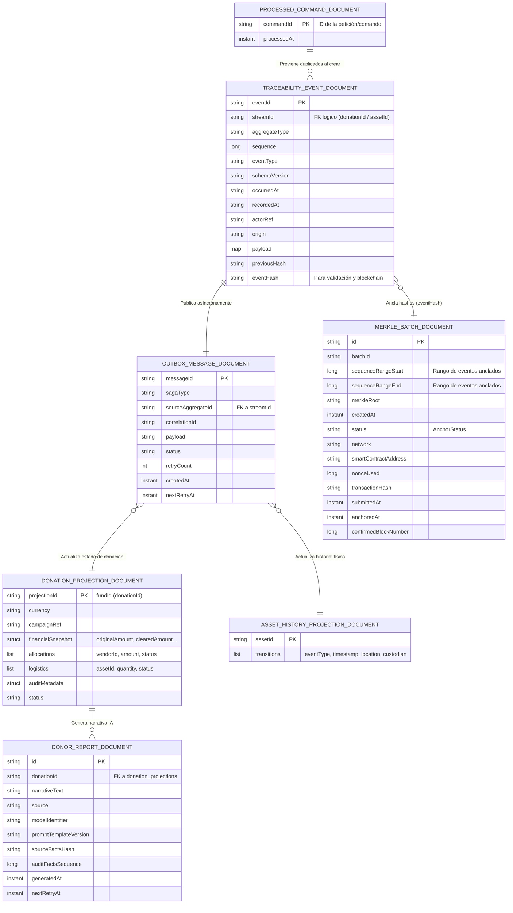

# Diagrama de la Base de Datos (MongoDB)

A continuación se muestra el diagrama Entidad-Relación (ER) de las colecciones de MongoDB, detallando los atributos principales de cada documento y cómo fluye la información o se relacionan entre sí a nivel lógico (al ser NoSQL, las relaciones suelen ser lógicas mediante IDs o proyección asíncrona).

### Notas sobre el diseño NoSQL:
*   **No hay Foreign Keys estrictas (FK):** Al usar MongoDB, las relaciones (indicadas con líneas y `FK lógico` en el diagrama) se hacen mediante identificadores compartidos como `streamId`, `donationId` o `assetId`.
*   **Asincronía (CQRS):** La colección `outbox` funciona como un puente temporal. Los datos entran por `TRACEABILITY_EVENT_DOCUMENT` y luego un proceso en segundo plano (worker) lee el `outbox` y escribe el estado final en `DONATION_PROJECTION_DOCUMENT` y `ASSET_HISTORY_PROJECTION_DOCUMENT`.
*   **Auditoría y Confianza:** `MERKLE_BATCH_DOCUMENT` no almacena eventos completos, solo un rango de "secuencias" y una raíz matemática (`merkleRoot`) calculada a partir de los `eventHash` de la colección de eventos, lo cual conecta el mundo privado con el contrato inteligente en Web3.
