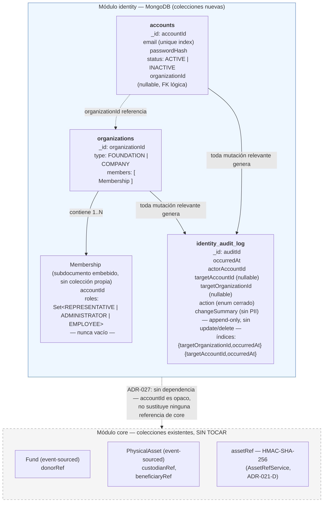

# Estado — Fase 4: Módulo de Identidad y Cuentas

**Proyecto:** Motor de Trazabilidad Verificable de Donaciones (`com.traceability`)
**Fase actual:** Fase 4 — **COMPLETADA.** Diseño arquitectónico (ADR-025/026/027) y las 11 tareas de implementación (4.0 a 4.10) cerradas, con evidencia literal verificada tarea por tarea. Reactor completo (7 módulos) en verde desde la raíz.
**Fases previas:** 1, 2 y 3 formalmente cerradas (ver `documento-maestro-proyecto.md`, `estado-fase3.md`).
**Pendiente fuera de esta fase:** incorporar formalmente ADR-025/026/027 al catálogo vivo de `documento-maestro-proyecto.md` en el repositorio real (ya reflejado en la copia de este documento, sección 5-VII).

---

## 1. ADRs de esta fase

| ADR | Título | Status |
|---|---|---|
| ADR-025 | Persistencia de Identidad y Cuentas | **Approved** — 2026-09-08 |
| ADR-026 | Modelo de Dominio de Identidad | **Approved** — 2026-09-08 |
| ADR-027 | Módulo Maven independiente `identity` | **Approved** — 2026-09-08 |

Catálogo del proyecto pasa de ADR-001..024 a **ADR-001..027**. Pendiente: incorporar estos tres a `documento-maestro-proyecto.md` en el repositorio real (esta sesión solo tiene copias de lectura de los documentos del proyecto).

---

## 2. Decisiones congeladas — resumen ejecutivo

- **Sin Event Sourcing en Identidad.** CRUD sobre MongoDB + Audit Log append-only, sin cadena criptográfica (ADR-025).
- **Dos Aggregate Roots:** `Account` y `Organization` (ADR-026).
- **Pertenencia única:** una `Account` pertenece a cero o una `Organization` — el sistema sí admite múltiples `Organization`, lo prohibido es que una misma cuenta pertenezca a más de una a la vez.
- **Membresía unificada:** `Organization.members: List<Membership>`, `Membership.roles: Set<Role>` — nunca tres listas paralelas, nunca `roles = {}`.
- **Roles:** `REPRESENTATIVE` (exactamente uno por Organization, en todo momento), `ADMINISTRATOR` (0..N, opcional, sin invariante de orfandad), `EMPLOYEE` (rol base de incorporación vía `AddEmployee`).
- **Transferencia de representación:** único comando `TransferRepresentativeAndRemove`, atómico, sin estados intermedios inválidos. `RemoveMemberFromOrganization` nunca puede expulsar directamente a un Representative.
- **Multi-tenancy:** descartado — sin evidencia de negocio que lo justifique.
- **`GOVERNMENT`/entidad pública:** fuera de alcance de Fase 4 — requiere análisis de invariantes propio antes de considerarse.
- **Concurrencia:** transacciones ACID de MongoDB (Replica Set ya configurado), reintento acotado (2–3 intentos) solo ante `TransientTransactionError`; los fallos deterministas de dominio nunca se reintentan.
- **PII Vault acotado:** Identidad custodia únicamente la PII de sus propias cuentas (email, password). No modifica, reemplaza ni centraliza `donorRef`, `custodianRef`, `beneficiaryRef` ni `assetRef` de `core` (ADR-014, ADR-021-D siguen intactos).
- **Módulo Maven independiente `identity`**, estructura hexagonal equivalente a `core`, sin Spring Security, sin dependencia hacia `contracts` salvo necesidad futura real.
- **Hashing de contraseñas:** BCrypt vía `spring-security-crypto` (dependencia aislada, sin `spring-boot-starter-security`), factor de costo 12 — resuelto en `plan-ejecucion-agentes-fase4.md`, no amerita ADR propio.

---

## 3. Catálogo de comandos

### `Account`
`CreateAccount`, `ChangeCredentials`, `DeactivateAccount`, `ReactivateAccount`

### `Organization`
`CreateOrganization`, `AddEmployee`, `AssignAdministrator`, `RemoveAdministrator`, `RemoveEmployee`, `RemoveMemberFromOrganization`, `TransferRepresentativeAndRemove`

### Excepciones de dominio
`DuplicateEmailException`, `AccountNotFoundException`, `OrganizationNotFoundException`, `AccountAlreadyBelongsToOrganizationException`, `AccountNotMemberOfOrganizationException`, `CannotRemoveLastRoleException`, `RepresentativeTransferRequiredException`, `TransferTargetNotMemberException`, `SelfTransferNotAllowedException`

---

## 4. Estructura de base de datos — diagrama

Tres colecciones nuevas, todas bajo el módulo `identity`, sin tocar ninguna colección de `core` (`event_store`, `donation_projections`/`donation_views`, `asset_index`, `asset_history`, `merkle_batches`, etc. — ver auditoría de colecciones existentes ya realizada en el hilo de Fase 3).

**Notas sobre el diagrama:**
- `Membership` no tiene colección propia — vive como array embebido dentro del documento `organizations`, tal como fija ADR-026. El invariante "exactamente un `REPRESENTATIVE`" se protege en el Aggregate, **no** por una constraint de esquema MongoDB (riesgo aceptado explícitamente en ADR-026).
- La flecha punteada `accounts → organizations` representa una referencia lógica por `organizationId`, no una relación de MongoDB (no hay `$lookup` obligatorio en el modelo de escritura — las operaciones cross-colección se resuelven en el Application Service dentro de una transacción ACID, ADR-025).
- La frontera entre `identity` y `core` es deliberadamente una línea punteada sin flujo de datos real — refleja el *scope boundary* de ADR-027: ningún identificador de Identidad sustituye o alimenta `donorRef`/`custodianRef`/`beneficiaryRef`/`assetRef`.

---

## 5. Política de ejecución con herramientas agénticas — resultado real

Se usó una herramienta agéntica de codificación (Antigravity) para ejecutar el backlog completo, bajo las guardas de `plan-ejecucion-agentes-fase4.md`. El resultado confirmó tanto el riesgo anticipado como la eficacia de las guardas:

- **El riesgo se materializó varias veces, no una.** Durante la ejecución real ocurrieron: evidencia de test parcialmente reconstruida de memoria en vez de citada literalmente (Tarea 4.1); un archivo de evidencia generado fuera del repositorio, en la carpeta interna del IDE, en más de una ocasión (Tareas 4.6 y 4.9); un `git add .` indiscriminado que estuvo a punto de arrastrar un residuo de una tarea anterior sin reportar (Tarea 4.9); un test de concurrencia que pasaba sin ejercitar genuinamente la condición que decía probar (Tarea 4.9); y un patrón repetido de ejecutar comandos largos en segundo plano sin declararlo, que resultó tener una causa técnica real (límite de ~10s de la herramienta antes de pasar a background automáticamente) y no ser negligencia pura.
- **Las guardas, exigidas sin excepción en cada entrega, atraparon los cinco incidentes antes de que llegaran a un commit aceptado.** Ninguno se coló en el código final — todos se corrigieron dentro de la misma tarea, con evidencia re-verificada, antes de avanzar a la siguiente.
- **La regla de "nunca background" resultó demasiado rígida** frente a una limitación técnica real de la herramienta; se corrigió a mitad de backlog (ver punto 4 de las guardas, sección "Precisión sobre comandos de larga duración") para exigir lo que sí importa — evidencia literal del resultado — sin exigir algo que la herramienta no podía garantizar.

**Conclusión:** el uso de una herramienta agéntica bajo revisión humana estricta, con guardas de evidencia verificadas en cada entrega, es viable — pero solo si la revisión es real y no una formalidad. Cada uno de los cinco incidentes se detectó porque la entrega se contrastó activamente contra el diff y el log pegados, nunca porque el resumen narrativo del agente pareciera suficientemente convincente.

## 6. Resumen de decisiones de implementación (sub-casos que ADR-026 dejó abiertos)

Compilado de las Tareas 4.2 a 4.9, para que quede en un solo lugar en vez de disperso en el historial de commits:

- **`deactivate()`/`reactivate()` de `Account` (Tarea 4.2):** idempotentes, sin excepción — retornan `boolean` indicando si hubo mutación real, para que el Application Service decida si genera Audit Log.
- **`changeCredentials()` sobre cuenta inactiva (Tarea 4.2):** excepción nombrada `InactiveAccountException` (corregido desde un `IllegalStateException` inicial — precondición de negocio, no error técnico genérico).
- **Mecanismo de mutación/no-op en `Organization`** (`assignAdministrator`/`removeAdministrator`/`removeEmployee`, Tarea 4.3): retorno `boolean`, mismo criterio que `Account`. `Membership.addRole()`/`removeRole()` son package-private — solo `Organization` puede mutar roles, nunca directamente sobre una `Membership` obtenida externamente.
- **Excepción cuando el "representante actual" es miembro pero no tiene el rol REPRESENTATIVE** (Tarea 4.4): `AccountNotRepresentativeException`, distinta de `AccountNotMemberOfOrganizationException` (que cubre el caso de no ser miembro en absoluto).
- **Reconstrucción de Aggregates desde persistencia** (Tarea 4.6): factories estáticas `Account.reconstitute(...)`/`Organization.reconstitute(...)`, `public` (el mapper vive en un paquete de infraestructura distinto), con Javadoc explícito de "uso exclusivo de adaptadores de persistencia, nunca de lógica de negocio" — no reabren los constructores privados existentes ni las reglas de `createAccount`/`createOrganization`.
- **Serialización de `Role` en `MembershipDocument`** (Tarea 4.6): `Set<Role>` directo — Spring Data MongoDB serializa el enum nativamente a String, sin necesidad de un mapeo manual campo por campo.
- **Límite transaccional del mecanismo de reintento** (Tarea 4.9): `TransactionTemplate` programático (`MongoTransactionRetryHelper`), no `@Transactional` declarativo — evita el problema de auto-invocación de Spring AOP dentro del propio bucle. Detección de `TransientTransactionError` vía `MongoException.hasErrorLabel()`, inspeccionando la cadena de `.getCause()`.
- **Determinar si el Representative saliente quedó fuera de la Organization tras la transferencia** (Tarea 4.9): se consulta `organization.getMembers()` sobre la misma instancia ya mutada en memoria, antes del `save()` — sin pedirle a `Organization` un método nuevo solo para este propósito.

## 7. Higiene del repositorio — resuelto en dos rondas

- **Ronda 1** (`chore/purge-tracked-build-artifacts`, entre Tareas 4.5 y 4.6): `core/target/` y `crypto/target/` trackeados por error desde la Tarea 4.0, pese a que el `.gitignore` ya tenía la regla — el problema era que ya estaban en el índice antes de que la regla existiera o se respetara. Purgados vía `git rm -r --cached`.
- **Ronda 2** (`chore/purge-tracked-build-artifacts-round-2`, tras el cierre de la Tarea 4.10): un `git ls-files | grep target/` ejecutado esta vez sobre el árbol **completo** del repositorio (la ronda 1 solo había verificado los dos módulos ya conocidos) encontró que `ai/target/`, `app/target/` y `contracts/target/` seguían trackeados — 46 archivos adicionales que la primera purga nunca detectó por estar acotada. Purgados de la misma forma, con verificación final de salida vacía sobre el árbol completo.
- **Estado final confirmado:** `git ls-files | grep -E '(^|/)target/'` retorna vacío en todo el repositorio.
- **Lección incorporada al proceso** (ver `plan-ejecucion-agentes-fase4.md`, guardas 5-7): cualquier diagnóstico de higiene de repositorio se corre sobre el árbol completo desde el principio, nunca acotado a los módulos donde ya se sospecha el problema; `git add .`/`-A` queda prohibido para cualquier propósito, incluida la captura de evidencia de diffs.

## 8. Siguiente paso

Fase 4 cerrada. Candidatos identificados para la siguiente fase (sin decisión formal todavía — requiere su propia sesión de Modo de Arquitectura):

- **Donaciones físicas (en especie) con trazabilidad directa al donante** — identificado durante la propia Fase 4 como fuera de su alcance, porque `PhysicalAsset` no tiene campo `donorRef`. Tocaría `core`, no `identity`.
- **Integración HTTP/autenticación sobre `identity`** — endpoints REST, login, sesión — explícitamente fuera de alcance de ADR-027 (Identidad hoy no expone nada por HTTP).
- **Vínculo entre `Account`/`Organization` y `Fund.donorRef`** — si se decide que un donante con cuenta debe ver su historial sin depender solo del tracking code, requiere su propio ADR y análisis de impacto sobre `core` (ver `documento-maestro-proyecto.md` sección 9.1, ítem 11).
