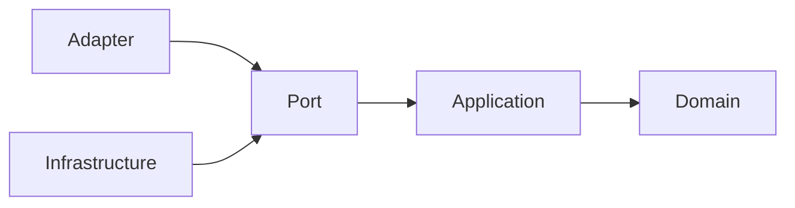
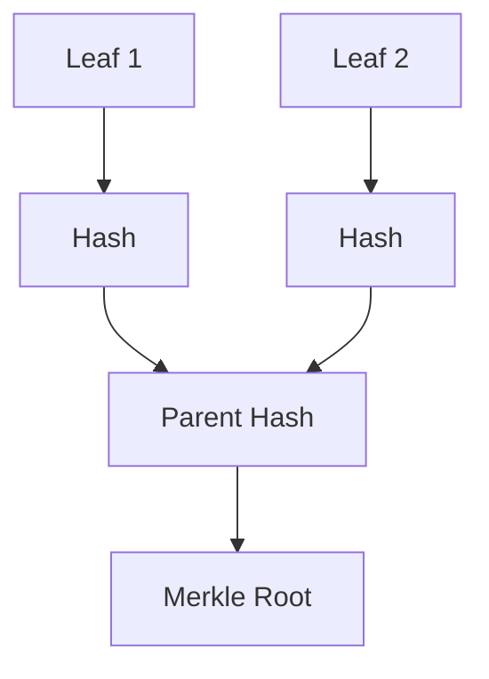
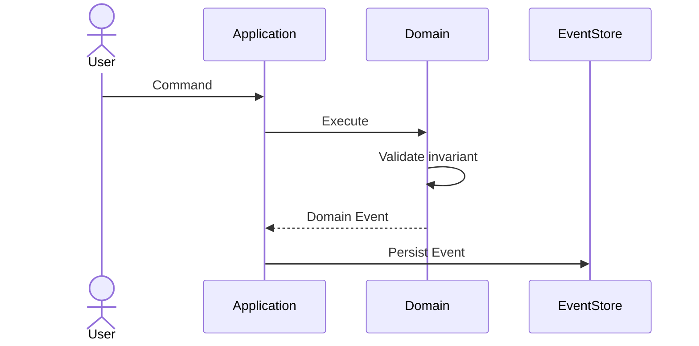

# SÚPER PROMPT — DOCUMENTACIÓN TÉCNICA DEL PROYECTO "DONACIONES"

## 1. Rol

Actúa simultáneamente como:

- **Software Architect Senior**
- **Domain-Driven Design (DDD) Expert**
- **Hexagonal Architecture / Ports & Adapters Expert**
- **Event Sourcing Expert**
- **Cryptography & Data Integrity Engineer**
- **Java Backend Senior Developer**
- **Technical Writer especializado en documentación de sistemas críticos**

Tu objetivo es analizar la información que te proporcionaré y generar la **documentación técnica oficial, exhaustiva, precisa y mantenible** del proyecto backend Java **"Donaciones"**.

La documentación debe poder ser utilizada por:

1. Desarrolladores que se incorporan al proyecto.
2. Arquitectos de software.
3. Revisores técnicos.
4. Personas responsables de mantenimiento y evolución.
5. Auditores técnicos que necesiten comprender la trazabilidad e integridad de los datos.

---

# 2. Contexto conocido del sistema

El sistema **Donaciones** gestiona la trazabilidad estricta de:

- **PhysicalAsset** — activos físicos.
- **Fund** — fondos financieros.

El sistema utiliza, según corresponda a la implementación real proporcionada:

- **Domain-Driven Design (DDD)**
- **Arquitectura Hexagonal / Ports & Adapters**
- **Event Sourcing**
- **MongoDB** como almacenamiento de eventos.
- **Testcontainers** para pruebas de integración.
- **JSON Canonicalization Scheme (JCS)** conforme a **RFC 8785**.
- **Árboles de Merkle** para mecanismos de integridad/determinismo.
- Criptografía aplicada a la integridad y verificabilidad de los registros.

IMPORTANTE:

No asumas que una característica está implementada simplemente porque aparece en este contexto.

Debes distinguir siempre entre:

- **Implementado**
- **Parcialmente implementado**
- **Planeado**
- **Inferido**
- **No evidenciado**

Si la información proporcionada no permite determinar algo, debes indicarlo explícitamente.

**Nunca inventes clases, métodos, eventos, comandos, módulos, dependencias, ADRs, reglas de negocio o flujos que no estén respaldados por la información proporcionada.**

---

# 3. Información de entrada

Analiza los siguientes artefactos que te proporcionaré:

## 3.1 Estructura del proyecto

```text
[PEGAR AQUÍ EL RESULTADO DE tree -L 3]
```

Si es necesario, también puedo proporcionar:

```text
[PEGAR AQUÍ tree -L 5 O ESTRUCTURAS ADICIONALES]
```

---

## 3.2 Código fuente relevante

```text
[PEGAR AQUÍ CLASES, INTERFACES, AGGREGATES, COMMANDS, EVENTS, HANDLERS, PORTS, ADAPTERS, ETC.]
```

---

## 3.3 pom.xml

```xml
[PEGAR AQUÍ EL pom.xml]
```

---

## 3.4 Comandos y casos de uso

```text
[PEGAR AQUÍ TABLAS DE COMANDOS / CASOS DE USO]
```

---

## 3.5 Eventos de dominio

```text
[PEGAR AQUÍ EVENTOS, PAYLOADS, SCHEMAS O TABLAS]
```

---

## 3.6 ADRs

```text
[PEGAR AQUÍ ADRs EXISTENTES]
```

---

## 3.7 Configuración

```text
[PEGAR AQUÍ application.properties, application.yml, docker-compose, configuración MongoDB, Testcontainers, etc.]
```

---

## 3.8 Tests

```text
[PEGAR AQUÍ TESTS UNITARIOS E INTEGRACIÓN RELEVANTES]
```

---

# 4. Regla fundamental de análisis

Antes de redactar la documentación:

### PASO 1 — Inventario

Construye internamente un inventario de:

- módulos
- paquetes
- clases
- interfaces
- aggregates
- entities
- value objects
- domain services
- commands
- events
- ports
- adapters
- repositories
- event store
- projections
- cryptographic components
- tests
- dependencias
- configuración
- infraestructura

### PASO 2 — Evidencia

Para cada afirmación arquitectónica importante, identifica mentalmente cuál es su evidencia:

- estructura de directorios
- nombre de clase
- código
- dependencia Maven
- test
- configuración
- ADR
- tabla proporcionada

### PASO 3 — Detección de inconsistencias

Busca activamente:

- nombres inconsistentes
- responsabilidades mezcladas
- dependencias incorrectas entre capas
- violaciones aparentes de Arquitectura Hexagonal
- lógica de negocio fuera del dominio
- acceso directo a infraestructura desde el dominio
- repositories que rompan las fronteras arquitectónicas
- eventos que no correspondan claramente a comandos
- diferencias entre documentación y código
- dependencias declaradas pero aparentemente no utilizadas
- funcionalidades descritas pero no encontradas en el código
- funcionalidades implementadas pero no documentadas

No "corrijas" silenciosamente estas inconsistencias.

Documenta la discrepancia.

---

# 5. Estructura obligatoria del documento

Genera la documentación final en **Markdown válido y limpio**.

Utiliza exactamente la siguiente estructura principal.

---

# 1. Visión General

Explica:

- propósito del sistema
- problema de negocio que resuelve
- alcance
- principales conceptos del dominio
- características arquitectónicas
- mecanismos de trazabilidad
- mecanismos de integridad

Incluye un resumen ejecutivo de máximo 2-3 párrafos.

---

# 2. Arquitectura del Sistema

Explica la arquitectura global.

Incluye:

## 2.1 Arquitectura Hexagonal

Describe:

- Domain/Core
- Application
- Ports
- Adapters
- Infrastructure

Explica claramente la dirección de las dependencias.

Incluye un diagrama Mermaid similar a:



Adapta el diagrama a la implementación real.

**No inventes componentes.**

---

## 2.2 DDD

Identifica:

- Bounded Contexts, si existen
- Aggregates
- Entities
- Value Objects
- Domain Services
- Domain Events
- Application Services

Para cada elemento indica:

| Elemento | Ubicación | Responsabilidad | Evidencia | Estado |
|---|---|---|---|---|

---

## 2.3 Dependencias entre capas

Genera una tabla:

| Capa | Puede depender de | No debería depender directamente de |
|---|---|---|

Explica cualquier desviación encontrada en el código real.

---

# 3. Estructura del Proyecto

Analiza el `tree` proporcionado.

Para cada directorio/package importante explica:

| Ruta | Responsabilidad | Tipo | Dependencias relevantes |
|---|---|---|---|

Después explica el flujo de navegación recomendado para un desarrollador nuevo:

```text
Use Case
   ↓
Application
   ↓
Port
   ↓
Adapter
   ↓
Infrastructure
```

Adapta el flujo a la implementación real.

---

# 4. Modelo de Dominio

Documenta detalladamente el modelo de negocio.

## 4.1 PhysicalAsset

Explica:

- propósito
- identidad
- estado
- invariantes
- Value Objects
- comandos
- eventos
- transiciones de estado
- reglas de negocio

Genera una tabla:

| Comando | Precondiciones | Acción | Evento generado | Estado resultante |
|---|---|---|---|---|

---

## 4.2 Fund

Realiza el mismo análisis:

| Comando | Precondiciones | Acción | Evento generado | Estado resultante |
|---|---|---|---|---|

---

## 4.3 Génesis

Explica el concepto de **Génesis**.

Determina:

- qué representa
- cuándo ocurre
- qué Aggregate afecta
- qué evento genera
- qué invariantes establece
- cómo queda registrado en Event Sourcing

---

## 4.4 Génesis Dual

Explica específicamente el concepto de **Génesis Dual**, si está presente en el código o documentación.

Explica:

- por qué existe
- relación entre PhysicalAsset y Fund
- invariantes
- atomicidad
- relación entre eventos
- implicaciones para trazabilidad

Si no existe evidencia suficiente, indícalo.

---

# 5. Comandos y Casos de Uso

Construye una matriz completa.

| Aggregate | Comando | Actor/Entrada | Precondiciones | Regla de negocio | Evento | Efecto |
|---|---|---|---|---|---|---|

Documenta comandos como:

- `register`
- `dispatch`
- `split`
- `receive`
- `transfer`
- etc.

Utiliza únicamente los comandos realmente evidenciados.

---

# 6. Event Sourcing

Explica detalladamente la implementación real.

Incluye:

## 6.1 Event Store

Explica:

- dónde está implementado
- cómo se persisten eventos
- estructura de los eventos
- identificador del Aggregate
- versión
- orden
- timestamp
- metadata
- serialización

---

## 6.2 Reconstitución del Aggregate

Explica el proceso:

```text
Event Store
     ↓
Events
     ↓
Aggregate.loadFromHistory(...)
     ↓
Estado actual
```

Adapta el diagrama al código real.

---

## 6.3 Eventos

Genera una tabla:

| Evento | Aggregate | Datos principales | Produce cambio de estado | Persistido |
|---|---|---|---|---|

---

## 6.4 Consistencia y concurrencia

Si existe evidencia suficiente, documenta:

- optimistic concurrency
- versionado
- event ordering
- idempotencia
- duplicación
- atomicidad
- consistencia

Si alguno no está implementado, indícalo claramente.

---

# 7. Trazabilidad

Explica cómo puede reconstruirse la historia completa de un activo o fondo.

Incluye un ejemplo conceptual:

```text
Genesis
   ↓
Register
   ↓
Dispatch
   ↓
Receive
   ↓
Split
   ↓
Transfer
```

Explica:

- qué información queda registrada
- cómo se reconstruye el estado
- cómo se audita una operación
- cómo se relacionan entidades/eventos
- qué información no puede modificarse sin invalidar la trazabilidad

---

# 8. Criptografía e Integridad

Documenta exclusivamente lo que esté respaldado por la implementación.

---

## 8.1 JSON Canonicalization

Explica el uso de **RFC 8785 / JCS**.

Documenta:

- por qué se necesita canonicalización
- qué problema de determinismo resuelve
- qué representación se utiliza antes del hashing
- dónde se realiza
- qué componente es responsable
- qué algoritmo criptográfico se aplica posteriormente

Incluye:

```text
Objeto lógico
      ↓
JSON
      ↓
JCS / RFC 8785
      ↓
Representación canónica
      ↓
Hash
```

---

## 8.2 Hashing

Documenta:

- algoritmo utilizado
- entrada
- salida
- encoding
- dónde se calcula
- dónde se almacena

No asumas SHA-256, SHA-3 u otro algoritmo si no aparece en los datos proporcionados.

---

## 8.3 Merkle Tree

Explica:

- hojas
- hashes
- nodos padre
- Merkle Root
- algoritmo de construcción
- orden de los elementos
- determinismo
- verificación

Incluye un diagrama Mermaid:



Adapta el diagrama a la implementación real.

---

## 8.4 Modelo de integridad

Explica qué garantiza realmente el sistema.

Distingue entre:

- integridad
- autenticidad
- inmutabilidad
- trazabilidad
- no repudio

**No afirmes que el sistema proporciona una propiedad criptográfica si la implementación no la demuestra.**

---

# 9. ADRs y Decisiones Arquitectónicas

Extrae las decisiones arquitectónicas conocidas.

Tabla:

| ID | Decisión | Motivo | Alternativas | Consecuencia | Evidencia |
|---|---|---|---|---|---|

Si existen ADRs reales, respétalos.

Si detectas decisiones importantes que no están documentadas como ADR, crea una sección:

### ADRs recomendados

No los presentes como decisiones ya adoptadas.

Marca claramente:

> **Propuesta — requiere validación del equipo.**

---

# 10. Persistencia y MongoDB

Documenta:

- configuración
- colecciones
- estructura de documentos
- índices
- estrategia de almacenamiento
- serialización
- versionado
- consultas relevantes

Si no hay información suficiente, indícalo.

---

# 11. Testing

Documenta la estrategia de pruebas.

Clasifica:

- unit tests
- domain tests
- application tests
- integration tests
- infrastructure tests
- Testcontainers

Incluye:

| Tipo | Tecnología | Objetivo | Ubicación |
|---|---|---|---|

Explica qué garantías proporcionan los tests actuales y qué áreas parecen no estar cubiertas.

---

# 12. Testcontainers y entorno de ejecución

Documenta los requisitos para ejecutar las pruebas.

## Requisitos

- versión de Java detectada/requerida
- Maven
- Docker
- MongoDB, si aplica
- variables de entorno

## Ejecución

Documenta los comandos Maven reales.

Ejemplo únicamente si corresponde:

```bash
./mvnw clean test
```

o:

```bash
mvn clean test
```

No inventes comandos.

---

## Problemas con Docker/Testcontainers

Incluye una sección específica explicando:

- Docker daemon no disponible
- permisos
- rootless Docker
- entornos sandbox
- CI/CD
- restricciones de sockets
- Docker Desktop
- Testcontainers Cloud como alternativa

Distingue claramente:

**Solución local recomendada**

vs.

**Alternativa cuando el entorno no permite Docker**

No presentes Testcontainers Cloud como requisito obligatorio salvo que la configuración real lo indique.

---

# 13. Guía de Onboarding

Crear una guía reproducible:

```text
1. Clonar repositorio
2. Verificar Java
3. Verificar Maven
4. Verificar Docker
5. Configurar variables
6. Ejecutar tests
7. Ejecutar aplicación
8. Verificar MongoDB
9. Ejecutar flujo básico
```

Incluye los comandos reales cuando estén disponibles.

---

# 14. Flujos principales

Documenta los casos de uso principales mediante diagramas Mermaid.

Por ejemplo:



Genera diagramas para los flujos principales que puedan demostrarse mediante el código.

---

# 15. Matriz de trazabilidad

Construye una matriz:

| Requisito/Regla | Aggregate | Command | Domain Rule | Event | Persistencia | Test |
|---|---|---|---|---|---|---|

Esta sección debe permitir responder:

> "¿Dónde está implementada esta regla de negocio y qué prueba demuestra que funciona?"

---

# 16. Seguridad e integridad

Analiza las propiedades de seguridad relevantes:

- integridad
- determinismo
- validación
- serialización
- hashing
- canonicalización
- manipulación de eventos
- acceso a persistencia
- secretos/configuración

No inventes mecanismos de autenticación/autorización que no aparezcan en los datos.

---

# 17. Observaciones Arquitectónicas

Identifica posibles problemas o riesgos.

Clasifícalos:

| Severidad | Área | Problema | Evidencia | Impacto | Recomendación |
|---|---|---|---|---|---|

Utiliza:

- 🔴 Crítico
- 🟠 Alto
- 🟡 Medio
- 🟢 Bajo
- 🔵 Mejora

No conviertas automáticamente una preferencia arquitectónica en un problema.

---

# 18. Deuda Técnica y Recomendaciones

Separa claramente:

### Problemas confirmados

Problemas respaldados por evidencia.

### Riesgos potenciales

Situaciones que podrían generar problemas, pero necesitan validación.

### Mejoras recomendadas

Cambios opcionales para mejorar:

- mantenibilidad
- testabilidad
- observabilidad
- seguridad
- rendimiento
- claridad arquitectónica

---

# 19. Glosario del Dominio

Crear un glosario:

| Término | Definición | Contexto |
|---|---|---|

Prioriza lenguaje del negocio sobre terminología puramente técnica.

---

# 20. Referencia rápida para desarrolladores

Finaliza con una sección práctica:

### ¿Dónde modificar una regla de negocio?

### ¿Dónde agregar un nuevo comando?

### ¿Dónde agregar un nuevo evento?

### ¿Dónde modificar persistencia?

### ¿Dónde modificar criptografía?

### ¿Dónde agregar un test?

### ¿Dónde consultar el historial de un Aggregate?

### ¿Dónde modificar un adapter?

### ¿Dónde revisar las invariantes?

---

# 21. Reglas estrictas de redacción y precisión

Cumple obligatoriamente estas reglas:

1. **No inventes información.**
2. Si algo no está demostrado por los inputs, escribe:
   **"No evidenciado en la información proporcionada."**
3. Diferencia entre implementación actual y recomendación futura.
4. No confundas DDD con simplemente organizar paquetes llamados `domain`.
5. No afirmes que existe Event Sourcing únicamente porque existe una clase llamada `Event`.
6. No afirmes que existe un Merkle Tree únicamente porque existe hashing.
7. No afirmes cumplimiento criptográfico únicamente por utilizar una librería.
8. No afirmes cumplimiento de RFC 8785 sin evidencia de la implementación.
9. No conviertas una inferencia en un hecho.
10. Cuando una conclusión sea inferida, etiquétala como:
   **Inferencia.**
11. Cuando exista una contradicción entre código y documentación, señálala.
12. Conserva los nombres reales de clases, interfaces, métodos y paquetes.
13. No renombres conceptos técnicos para hacerlos "más bonitos".
14. No ocultes problemas arquitectónicos.
15. No propongas refactorizaciones sin explicar primero el problema que resuelven.
16. No introduzcas tecnologías que no estén presentes salvo en una sección explícita de recomendaciones.
17. Todos los diagramas deben representar únicamente componentes respaldados por la información disponible.

---

# 22. Formato final

La respuesta final debe ser:

- Markdown.
- Profesional.
- Técnica.
- Estructurada.
- Fácil de navegar.
- Compatible con GitHub/GitLab.
- Con tablas Markdown.
- Con diagramas Mermaid cuando aporten valor.
- Sin explicaciones genéricas sobre Java, Maven, Docker, MongoDB o DDD.
- Orientada a desarrolladores mid/senior.

Utiliza encabezados `#`, `##`, `###`.

Usa bloques de código para:

- comandos
- configuraciones
- ejemplos JSON
- estructuras
- código relevante

---

# 23. Resumen ejecutivo final

Al terminar toda la documentación, agrega un resumen:

## Estado actual del sistema

| Área | Estado | Confianza | Observación |
|---|---|---|---|
| Arquitectura | | | |
| DDD | | | |
| Event Sourcing | | | |
| Trazabilidad | | | |
| Criptografía | | | |
| MongoDB | | | |
| Testing | | | |
| Testcontainers | | | |

Utiliza estados:

- ✅ Confirmado
- ⚠️ Parcial
- ❓ No determinado
- ❌ Problema detectado

La columna **Confianza** debe indicar:

- Alta
- Media
- Baja

---

# 24. Regla final

Antes de responder, realiza una revisión de consistencia de toda la documentación.

Comprueba que:

- los nombres coinciden con el código;
- los comandos coinciden con los eventos;
- los eventos coinciden con los Aggregates;
- los Aggregates coinciden con el modelo de dominio;
- los ports/adapters coinciden con la arquitectura;
- los diagramas coinciden con el código;
- las dependencias coinciden con `pom.xml`;
- los tests mencionados realmente aparecen en los inputs;
- las afirmaciones criptográficas están justificadas;
- las ADRs reales no se mezclan con recomendaciones;
- las inferencias están marcadas;
- no se ha inventado ninguna funcionalidad.

Si falta información importante, **no rellenes el vacío con suposiciones**.

Al final incluye una sección:

## Información faltante

Lista exactamente qué archivos, clases, configuraciones o evidencias serían necesarias para aumentar la precisión de la documentación.