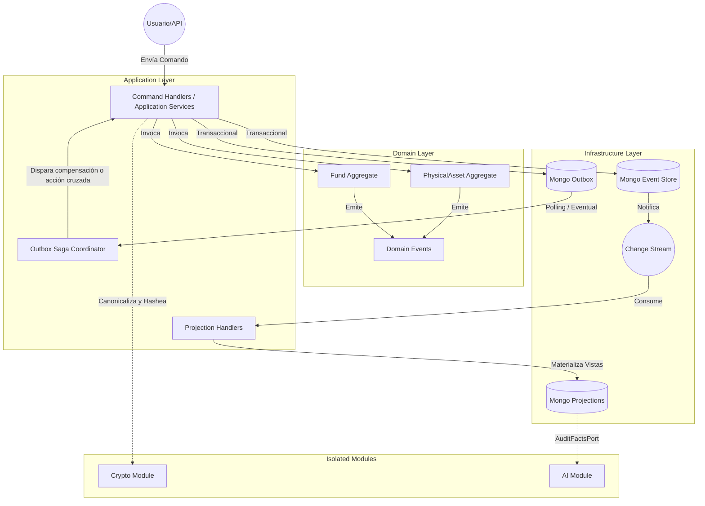
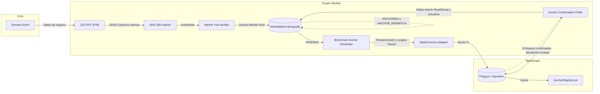
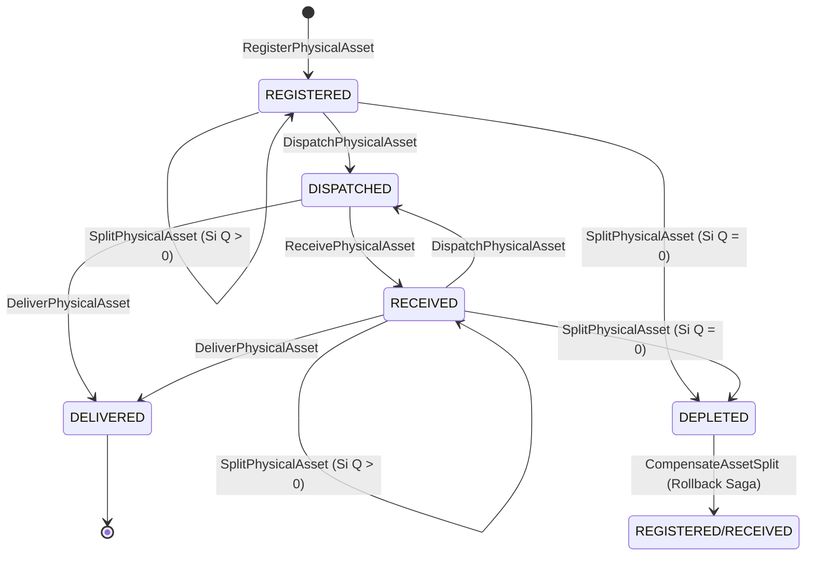
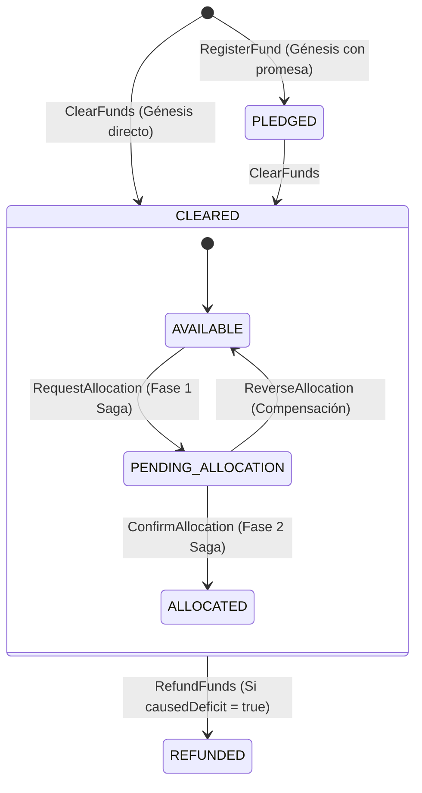

# Diagramas de Arquitectura — Sistema "Nexxus" (Fase 2 Completada)

A continuación, se presentan los diagramas que detallan la arquitectura implementada y verificada durante la Fase 2.

## 1. Arquitectura General y Flujo de Event Sourcing / CQRS

Este diagrama muestra el flujo desde la ingesta de un comando hasta la persistencia inmutable y su eventual materialización en las proyecciones y auditorías.

---

## 2. Pipeline Criptográfico y Anclaje en Blockchain (Web3j)

Este diagrama detalla cómo los eventos de dominio se transforman en una cadena inmutable y se anclan en Polygon/Ganache usando árboles de Merkle.

---

## 3. Máquinas de Estado de los Aggregates

### PhysicalAsset (Trazabilidad Logística)

### Fund (Trazabilidad Financiera)

