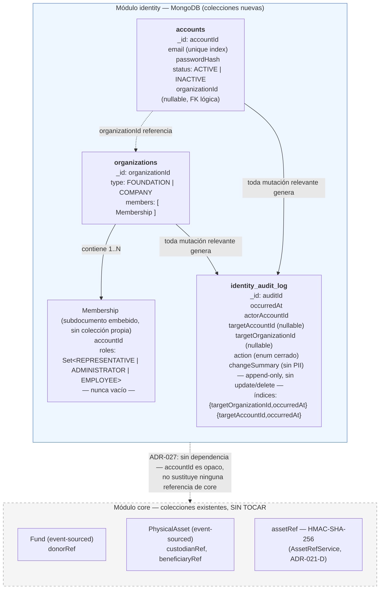

# Estado — Fase 4: Módulo de Identidad y Cuentas

**Proyecto:** Motor de Trazabilidad Verificable de Donaciones (`com.traceability`)
**Fase actual:** Fase 4 — Diseño arquitectónico **completo y aprobado**. Implementación **no iniciada** (backlog listo en `plan-ejecucion-agentes-fase4.md`).
**Fases previas:** 1, 2 y 3 formalmente cerradas (ver `documento-maestro-proyecto.md`, `estado-fase3.md`).

---

## 1. ADRs de esta fase

| ADR | Título | Status |
|---|---|---|
| ADR-025 | Persistencia de Identidad y Cuentas | **Approved** — 2026-09-08 |
| ADR-026 | Modelo de Dominio de Identidad | **Approved** — 2026-09-08 |
| ADR-027 | Módulo Maven independiente `identity` | **Approved** — 2026-09-08 |

Catálogo del proyecto pasa de ADR-001..024 a **ADR-001..027**. Pendiente: incorporar estos tres a `documento-maestro-proyecto.md` en el repositorio real (esta sesión solo tiene copias de lectura de los documentos del proyecto).

---

## 2. Decisiones congeladas — resumen ejecutivo

- **Sin Event Sourcing en Identidad.** CRUD sobre MongoDB + Audit Log append-only, sin cadena criptográfica (ADR-025).
- **Dos Aggregate Roots:** `Account` y `Organization` (ADR-026).
- **Pertenencia única:** una `Account` pertenece a cero o una `Organization` — el sistema sí admite múltiples `Organization`, lo prohibido es que una misma cuenta pertenezca a más de una a la vez.
- **Membresía unificada:** `Organization.members: List<Membership>`, `Membership.roles: Set<Role>` — nunca tres listas paralelas, nunca `roles = {}`.
- **Roles:** `REPRESENTATIVE` (exactamente uno por Organization, en todo momento), `ADMINISTRATOR` (0..N, opcional, sin invariante de orfandad), `EMPLOYEE` (rol base de incorporación vía `AddEmployee`).
- **Transferencia de representación:** único comando `TransferRepresentativeAndRemove`, atómico, sin estados intermedios inválidos. `RemoveMemberFromOrganization` nunca puede expulsar directamente a un Representative.
- **Multi-tenancy:** descartado — sin evidencia de negocio que lo justifique.
- **`GOVERNMENT`/entidad pública:** fuera de alcance de Fase 4 — requiere análisis de invariantes propio antes de considerarse.
- **Concurrencia:** transacciones ACID de MongoDB (Replica Set ya configurado), reintento acotado (2–3 intentos) solo ante `TransientTransactionError`; los fallos deterministas de dominio nunca se reintentan.
- **PII Vault acotado:** Identidad custodia únicamente la PII de sus propias cuentas (email, password). No modifica, reemplaza ni centraliza `donorRef`, `custodianRef`, `beneficiaryRef` ni `assetRef` de `core` (ADR-014, ADR-021-D siguen intactos).
- **Módulo Maven independiente `identity`**, estructura hexagonal equivalente a `core`, sin Spring Security, sin dependencia hacia `contracts` salvo necesidad futura real.
- **Hashing de contraseñas:** BCrypt vía `spring-security-crypto` (dependencia aislada, sin `spring-boot-starter-security`), factor de costo 12 — resuelto en `plan-ejecucion-agentes-fase4.md`, no amerita ADR propio.

---

## 3. Catálogo de comandos

### `Account`
`CreateAccount`, `ChangeCredentials`, `DeactivateAccount`, `ReactivateAccount`

### `Organization`
`CreateOrganization`, `AddEmployee`, `AssignAdministrator`, `RemoveAdministrator`, `RemoveEmployee`, `RemoveMemberFromOrganization`, `TransferRepresentativeAndRemove`

### Excepciones de dominio
`DuplicateEmailException`, `AccountNotFoundException`, `OrganizationNotFoundException`, `AccountAlreadyBelongsToOrganizationException`, `AccountNotMemberOfOrganizationException`, `CannotRemoveLastRoleException`, `RepresentativeTransferRequiredException`, `TransferTargetNotMemberException`, `SelfTransferNotAllowedException`

---

## 4. Estructura de base de datos — diagrama

Tres colecciones nuevas, todas bajo el módulo `identity`, sin tocar ninguna colección de `core` (`event_store`, `donation_projections`/`donation_views`, `asset_index`, `asset_history`, `merkle_batches`, etc. — ver auditoría de colecciones existentes ya realizada en el hilo de Fase 3).

**Notas sobre el diagrama:**
- `Membership` no tiene colección propia — vive como array embebido dentro del documento `organizations`, tal como fija ADR-026. El invariante "exactamente un `REPRESENTATIVE`" se protege en el Aggregate, **no** por una constraint de esquema MongoDB (riesgo aceptado explícitamente en ADR-026).
- La flecha punteada `accounts → organizations` representa una referencia lógica por `organizationId`, no una relación de MongoDB (no hay `$lookup` obligatorio en el modelo de escritura — las operaciones cross-colección se resuelven en el Application Service dentro de una transacción ACID, ADR-025).
- La frontera entre `identity` y `core` es deliberadamente una línea punteada sin flujo de datos real — refleja el *scope boundary* de ADR-027: ningún identificador de Identidad sustituye o alimenta `donorRef`/`custodianRef`/`beneficiaryRef`/`assetRef`.

---

## 5. Política de ejecución con herramientas agénticas

Se evaluó usar una herramienta agéntica de codificación (Antigravity u otra equivalente) para ejecutar el backlog. Antigravity, en particular, reporta su propio trabajo mediante "Artifacts" autogenerados (walkthroughs, capturas, resúmenes de tarea) — un mecanismo que coincide con el patrón que originó `reglas-equipo-y-agentes.md` en Fase 2 (un `walkthrough.md` describiendo tareas no ejecutadas, aceptado sin verificación literal).

**Decisión:** se puede usar una herramienta agéntica para ejecutar `plan-ejecucion-agentes-fase4.md`, pero sujeta a las guardas explícitas ya incorporadas en ese documento:

- el Artifact/walkthrough de la herramienta nunca sustituye el output literal de Surefire ni el `git diff` real;
- una tarea por entrega, nunca el backlog completo de una sola vez, con aprobación humana del PR entre cada una;
- verificación explícita de que el entorno de la herramienta corre MongoDB como Replica Set antes de cualquier tarea con Testcontainers (4.6 en adelante).

Ver el detalle completo en la sección "Guardas de ejecución con herramientas agénticas" de `plan-ejecucion-agentes-fase4.md`.

## 6. Siguiente paso

Backlog de implementación listo en `plan-ejecucion-agentes-fase4.md` — 11 tareas (4.0 a 4.10), de dominio puro a integración end-to-end, cada una con su rama, su ADR de referencia y su Definition of Done. Ninguna tarea se abre sin que la anterior cierre con evidencia literal, según `reglas-equipo-y-agentes.md`.

**Primera tarea a ejecutar:** 4.0 — Scaffolding del módulo Maven `identity`.
