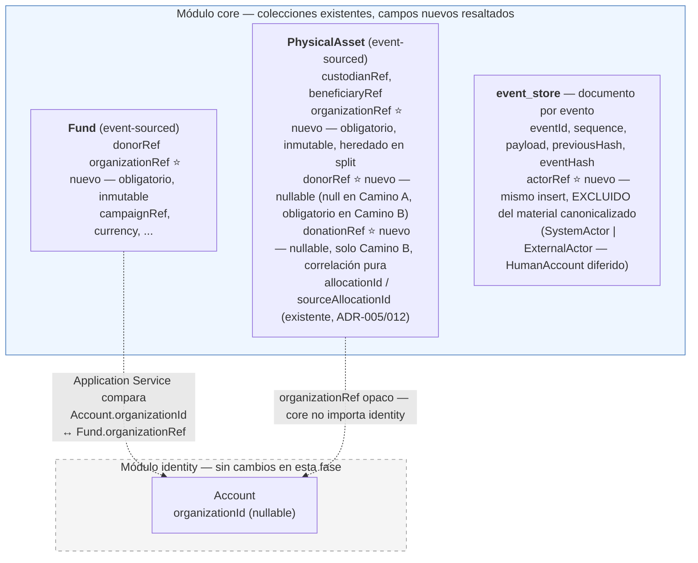

# Estado — Fase 5: Bloque de Dominio (cerrado) + Bloque C/D — Autorización (mecanismo y matriz cerrados) + Implementación (EN CURSO, PAUSADA)

**Proyecto:** Motor de Trazabilidad Verificable de Donaciones (`com.traceability`)
**Fase actual:** Fase 5 — **CERRADA**
- **Bloque de dominio** (`Organization↔Fund`, `Organization↔PhysicalAsset`, donación en especie, `actorRef`) — **DISEÑO Y IMPLEMENTACIÓN CERRADOS**
- **Bloque C/D** (autorización, puerto Identity↔Core) — **DISEÑO E IMPLEMENTACIÓN CERRADOS (ADR-032, ADR-035).**
Este documento registra el cierre formal de la Fase 5 verificado con evidencia.
**Fases previas:** 1, 2, 3 y 4 formalmente cerradas (ver `documento-maestro-proyecto.md`, `estado-fase4.md`).
**Alcance del bloque de dominio, fijado desde el primer intercambio de esta fase:** dominio de negocio únicamente. Autorización, autenticación y escritura HTTP quedaron explícitamente pospuestas a un bloque separado (Bloque C/D) desde antes de abrir la primera pregunta de arquitectura — esa frontera se mantuvo sin excepción durante todo el bloque de dominio, y Bloque C/D, ya abierto, respeta la misma disciplina de no inventar política de negocio sin evidencia documental (ver §9).

---

## 1. ADRs de esta fase

| ADR | Título | Status |
|---|---|---|
| ADR-028 | Relación `Organization ↔ Fund` | **Approved** |
| ADR-016 | Génesis Dual de `Fund` | **Approved with amendment** — `ClearFunds` se expresa en dos casos de uso de aplicación (`ClearFundsAsGenesis` / `ClearFundsForPledge`); `FUNDS_CLEARED:v2` mantiene un único esquema de payload en ambos |
| ADR-029 | `Organization ↔ PhysicalAsset` + Donación en Especie | **Approved** — Camino A (herencia desde `Fund`) implementable; Camino B (génesis directa) diseñado pero con implementación bloqueada, ver §5 |
| ADR-030 | `actorRef` — ubicación y persistencia | **Approved** |
| ADR-031 | Taxonomía de `ActorRef` | **Approved** |
| ADR-032 | Autorización de comandos en `core`: puerto Identity↔Core, guardas de pertenencia y rol, matriz de autorización | **Approved** |
| ADR-033 | Contrato del payload de la saga `ASSET_REGISTRATION_SAGA` | **Approved** |
| ADR-034 | Visibilidad y Operabilidad de Pending Allocation (NUEVA-4 redefinida) | **Approved** |
| ADR-035 | HumanActor como variante de ActorRef y puente de autorización humana | **Approved** |
| ADR-036 | Reversión Administrativa de Asignación (NUEVA-4B) | **Approved** |

Catálogo del proyecto actual llega hasta **ADR-036** (más la enmienda a ADR-016). ADR-033, ADR-034, ADR-035 y ADR-036 ya forman parte del historial integrado en `develop`. *Nota documental post-auditoría*: Los archivos físicos de los ADR-028 a ADR-032 no fueron incorporados en `Documentos/` durante la Fase 5. No obstante, las decisiones principales y justificaciones se encuentran sustancialmente referenciadas en `plan-ejecucion-agentes-fase5.md` y `estado-fase5.md`, permitiendo su reconstrucción documental a partir de fuentes internas históricas como deuda de documentación futura.

---

## 2. Decisiones congeladas — resumen ejecutivo

### `Organization ↔ Fund` (ADR-028)
- `Organization` **gestiona/opera** el `Fund` — autoridad operativa, explícitamente no ownership jurídico ni financiero.
- `Fund.organizationRef`: Value Object opaco, obligatorio en `create()`, fijado en génesis, **inmutable** durante todo el lifecycle. Ningún comando de reasignación existe en el alcance de esta fase.
- `core.domain.fund` sigue sin importar nada de `identity`.
- Dos guardas separadas por responsabilidad: `FundNotAssociatedToOrganizationException` (dominio, dentro de `Fund.execute()`, protege "¿es operable en absoluto?") y `CrossOrganizationAccessException` (Application, compara el identificador subyacente de `Account.organizationId` — nullable — contra `Fund.organizationRef`; cubre tanto "sin organización" como "organización distinta").
- `Fund` v1 (sin `organizationRef`): `reconstitute()`/lectura/rebuild permitidos, comandos de escritura rechazados **permanentemente**. Sin `UNASSIGNED`, sin backfill, sin mecanismo de migración — decisión explícita por ausencia de necesidad de negocio demostrada.

### `ClearFunds` — enmienda a ADR-016
- `ClearFundsAsGenesis` (génesis directa, `sequence = 0`) y `ClearFundsForPledge` (transición sobre `Fund` existente, `sequence > 0`) son dos casos de uso de aplicación distintos.
- `ClearFundsForPledge` **no** recibe `organizationRef`/`campaignRef`/`donorRef`/`currency` como input — se leen del `Fund` reconstituido.
- `FUNDS_CLEARED:v2` mantiene **un único esquema de payload** en ambos caminos — el Application Service rellena los campos ya establecidos cuando el origen es la transición, evitando bifurcación en `EventPayloadRegistry`, JCS y hash chain.

### `Organization ↔ PhysicalAsset` + Donación en Especie (ADR-029)
- `organizationRef`: mismo eje que en `Fund` — autoridad, distinta de `custodianRef` (responsabilidad operativa actual, ADR-003) y `beneficiaryRef` (receptor final, ADR-014).
- **Camino A** (asignación de `Fund`): `organizationRef` heredado vía `AssetRegisteredSagaPolicy`; `donorRef = null` — el donante financiero **no** se hereda como donante físico (distinción semántica deliberada, no técnica).
- **Camino B** (donación en especie): `organizationRef` y `donorRef` como dato de entrada directo, obligatorios. `InKindDonation` **descartado** como Aggregate — sin evidencia de invariante persistible previa al `PhysicalAsset`. Cardinalidad 1:N sin invariante entre hermanos, correlacionados por `donationRef` (generado server-side, correlación pura, sin lifecycle, sin comando propio — Modelo 1: una única invocación de aplicación por acto de donación). Fallo parcial entre hermanos es un estado aceptado, sin compensación.
- `ASSET_REGISTERED:v2` mantiene un único esquema uniforme entre ambos caminos — los campos son `null` según semántica de génesis, nunca por bifurcación de tipo.
- `ASSET_SPLIT`: `organizationRef`, `donorRef` y `donationRef` se heredan íntegros a todo hijo, sin excepción, sin campo `source*` paralelo (a diferencia de `allocationId`/`sourceAllocationId` — no aplica el mismo patrón porque no representan una operación puntual del asset, sino un hecho de procedencia del lote).
- `PhysicalAsset` v1 sin `organizationRef`: mismo tratamiento que `Fund` v1 — lectura/reconstitución sí, escritura permanentemente no.

### `actorRef` (ADR-030 + ADR-031)
- Finalidad de auditoría administrativa, **no** de integridad criptográfica — decisión tomada sobre mérito de negocio (la garantía criptográfica del hash solo protegería la atribución *almacenada*, nunca la autenticidad real del ejecutor, mientras la autenticación siga fuera de alcance).
- No participa en `EventCanonicalMapper`/JCS/`eventHash`/`previousHash`/Merkle. No forma parte de `DomainEventPayload`. El replay puro del Aggregate no lo reconstruye ni depende de él.
- Persistencia: mismo documento MongoDB que el evento, mismo insert atómico — sin ventana de inconsistencia entre "el evento existe" y "la atribución existe". Inmutable **por contrato de persistencia**, explícitamente **no protegido criptográficamente**.
- Sin requisito de negocio demostrado para corregibilidad administrativa — verificado contra los 13 documentos del proyecto, sin evidencia. Si aparece esa necesidad, requiere su propio ADR.
- Taxonomía: `ActorRef` es contrato tipado y extensible, no `enum` cerrado ni `String` plano. Variantes válidas hoy: `SystemActor(policyName)` y `ExternalActor(sourceSystem, externalEventId)` — este último reutiliza `externalEventId` de ADR-013, sin certificar autenticidad del sistema externo. `origin` descartado como concepto independiente — completamente absorbido por la taxonomía.
- **`HumanAccount` diferido** al diseño del mecanismo de escritura autenticada — deliberadamente no se anticipa su forma.

---

## 3. Catálogo de comandos (diseñados en esta sesión)

### `Fund`
- `RegisterFund(organizationRef, campaignRef, donorRef, currency, pledgedAmount, commandId)` — `organizationRef` ahora obligatorio.
- `ClearFundsAsGenesis(organizationRef, campaignRef, donorRef, currency, amount, commandId)`.
- `ClearFundsForPledge(fundId, amount, commandId)` — no recibe datos de identidad del `Fund`, se leen del Aggregate reconstituido.

### `PhysicalAsset`
- `RegisterPhysicalAsset(...)` (Camino A, existente) — no recibe `organizationRef`/`donorRef` como input; ambos heredados vía saga.
- `RegisterPhysicalAssetFromDonation(organizationRef, donorRef, donationRef*, assetType, quantity, unitOfMeasure, custodianRef, currentLocation, commandId)` (Camino B) — **diseñado, implementación bloqueada, ver §5**. `donationRef` no es parámetro del comando individual, se genera una vez por invocación de Application Service y se reutiliza en cada registro dentro de esa misma llamada.
- `SplitPhysicalAsset(...)` (existente) — no recibe `organizationRef`/`donorRef`/`donationRef`; los tres se heredan del padre.

### Excepciones de dominio nuevas
`FundNotAssociatedToOrganizationException` (dominio, `Fund`), `CrossOrganizationAccessException` (Application).

---

## 4. Modelo de datos — diagrama de cambios sobre Fase 4



**Notas sobre el diagrama:**
- Ninguno de los tres campos nuevos (`organizationRef` en `Fund`/`PhysicalAsset`, `donorRef`/`donationRef` en `PhysicalAsset`, `actorRef` en el evento) rompe el aislamiento `core ↮ identity` ya establecido en ADR-027 — todos son referencias opacas o metadata de persistencia, nunca tipos importados.
- `actorRef` vive en el mismo documento del evento pero **fuera** del subconjunto de campos que entra a `EventCanonicalMapper` — la línea entre "parte del evento" y "parte de la evidencia criptográfica del evento" queda explícitamente distinta a partir de esta fase.

---

## 5. Bloqueador explícito de implementación

**`RegisterPhysicalAssetFromDonation` (Camino B, donación en especie) no es implementable todavía.**

Por diseño de negocio, es el único comando de génesis del sistema sin `SagaPolicy` que lo dispare automáticamente ni webhook externo asociado — solo puede ser ejecutado por un operador humano. La taxonomía de `ActorRef` cerrada en ADR-031 no tiene hoy ninguna variante legítima para representar esa atribución (`SystemActor`/`ExternalActor` no aplican; `HumanAccount` está diferido). ADR-031 prohíbe explícitamente sustituir esa ausencia con `null`, texto libre o un actor provisional.

```text
ADR-031 → HumanActor implementado vía ADR-035 → autenticación en contracts lista → Camino B → **implementación completada y mergeada (Tarea 5.4)**
```

Esto es una restricción **arquitectónica y normativa**, no una nota de planificación — no depende de en qué orden se ejecute el backlog, depende de que exista una variante formal de `ActorRef` para identidad humana.

**Consecuencia sobre priorización:** donación en especie fue identificada al inicio de esta fase como funcionalidad 🔴 crítica. Su diseño de dominio está completo y aprobado (ADR-029), pero su implementación depende directamente del bloque de autenticación — esto debe reflejarse en cualquier backlog o estimación de fase, no descubrirse durante la ejecución.

---

## 6. Alcance explícitamente pendiente

Actualizado tras el diseño completo de Bloque C/D (§9) — el diseño y la política de negocio conocida están cerrados; lo que sigue pendiente son huecos genuinos descubiertos durante el diseño, no partes del mecanismo sin resolver:

- **Derivación de `organizationRef` para `ExternalActor`** (§9.6) — el webhook de la pasarela de pago puede disparar `CLEAR_FUNDS_AS_GENESIS`/`CLEAR_FUNDS_FOR_PLEDGE`, pero no existe mecanismo diseñado para mapear el contexto del pago externo (campaña, comercio) a un `organizationRef` concreto. Sin este mecanismo, ese camino automatizado no puede construir el comando correctamente — solo queda clara la ruta humana (P7.1-P7.3).
- **Escritura HTTP** — ningún endpoint se diseñó todavía. El mecanismo de autorización (§9) está listo para ser invocado desde un futuro controller, pero ningún endpoint, DTO de request/response, ni framework de exposición (Spring Security o equivalente) se decidió en esta fase.
- **Implementación real** de todo lo diseñado en §9 (P7, P9, P10, P11) — hasta ahora, solo diseño de Modo de Arquitectura, sin código ni tests.

---

## 9. Bloque C/D — Autorización: mecanismo y matriz de negocio cerrados

Formalizado como **ADR-032 — Approved**. Diseño realizado en la misma sesión de Fase 5, tras cerrar el bloque de dominio. Quedan explícitamente fuera de ADR-032, sin colarse por la puerta trasera: diseño concreto de `HumanAccount`, autenticación, escritura HTTP, derivación de `organizationRef` para `ExternalActor`, y `CommandDispatcher` central.

### 9.1 — P11: puerto `Identity ↔ Core`
- Patrón reutilizado del ya validado para `crypto`/`ai`: **`contracts`** (interfaces + DTOs puros, cero infraestructura) como frontera neutral — no dependencia directa `core ↔ identity` en ningún sentido.
- `IdentityPrincipalPort` (interfaz, en `contracts`) + `AuthorizationPrincipal` (DTO): `accountId: String` (opaco), `organizationId: String?` (opaco, nullable), `roles: Set<AuthorizationRole>`.
- `AuthorizationRole`: tipo **propio del contrato**, no espejo de `identity.domain.Role` — anti-corruption layer explícito. Mapeo `identity.domain.Role → AuthorizationRole` vía `switch` expression **exhaustivo, sin `default`** (Java 21) — un rol nuevo en Identity sin clasificar deja de compilar, no falla en runtime. Corrección semántica del mapeo (`ADMINISTRATOR → ADMINISTRATOR`, no un typo) queda cubierta por unit test aparte — exhaustividad y corrección son propiedades distintas.
- Nueva arista de dependencia: `identity → contracts` (antes evitada por "sin necesidad real de comunicación cruzada", ADR-027 — ahora justificada). `identity → core` y `core → identity` permanecen ambas inexistentes.
- `accountId`/`organizationId` permanecen `String` sin Value Object contractual nuevo — son identificadores opacos que se transportan, no conceptos que requieran reinterpretación entre módulos (a diferencia de `roles`, que sí traduce un modelo de capacidades a un modelo de autorización).

### 9.2 — P9: determinación de pertenencia organizacional
- `OrganizationBoundaryPolicy` — componente **stateless** en `core.application.authorization`, sin conocer ningún Aggregate concreto. Firma: `assertBelongs(principalOrganizationId: String?, resourceOrganizationRef: String)`.
- Centralizado deliberadamente (no duplicado por Application Service) porque cumple los cuatro criterios que justifican centralizar una guarda de seguridad: semántica normativa idéntica en todos sus puntos de aplicación, misma excepción, orden de evaluación obligatorio, y una divergencia accidental tendría consecuencia de autorización, no solo de mantenimiento.
- La **extracción** de `organizationRef` sigue siendo responsabilidad de cada `*CommandService` (ya tiene el Aggregate cargado) — no se introduce ninguna interfaz compartida (`HasOrganizationRef` o similar) entre `Fund` y `PhysicalAsset`: eso reabriría, sin necesidad demostrada, la segregación de Aggregates de ADR-001.
- `null` en cualquiera de los dos lados, o mismatch, produce `CrossOrganizationAccessException` — misma excepción para ambos casos, sin variantes locales.
- Se evalúa **antes** que el rol. Ningún rol, actual o futuro, tiene bypass de esta guarda — un bypass cross-organization requeriría una nueva decisión arquitectónica explícita, no una excepción implícita en la matriz de P7.

### 9.3 — P10: composición
```text
Application Service
        │
        ├── 1. OrganizationBoundaryPolicy.assertBelongs(...)
        │         └── falla → CrossOrganizationAccessException (fin, rol no se evalúa)
        │
        ├── 2. RoleAuthorizationPolicy.authorize(principal, CommandType.X)
        │         └── falla → excepción de autorización por rol (fin)
        │
        └── 3. Aggregate.execute(command)
```
Composición estrictamente secuencial, ambas guardas en `core.application`, ninguna en `core.domain`. Estructural — la composición queda cerrada independientemente de los valores concretos de la matriz de P7. La matriz ya está completa en §9.5; la separación entre composición y política de negocio se conserva porque son decisiones arquitectónicas distintas.

### 9.4 — P7, mecanismo (distinto de la matriz, ver §9.5)
- `CommandType`: `enum` cerrado en `core.application.authorization` (`REGISTER_FUND`, `CLEAR_FUNDS_AS_GENESIS`, `CLEAR_FUNDS_FOR_PLEDGE`, `REGISTER_PHYSICAL_ASSET`, `REGISTER_PHYSICAL_ASSET_FROM_DONATION`, `SPLIT_PHYSICAL_ASSET`) — clave primaria de la matriz (`CommandType → roles`, no `Role → comandos`, porque expresa mejor la pregunta que resuelve: "para ejecutar esta operación, ¿qué roles bastan?").
- `RoleAuthorizationPolicy.authorize(principal, commandType)`: `switch` expression exhaustivo sobre `CommandType`, sin `default` — mismo mecanismo que el mapeo de roles en P11, aplicado aquí para que un `CommandType` nuevo sin política asignada no compile.
- Autorización declarada **centralizadamente**, no vía `requiredRole()` en cada `Command` ni anotaciones distribuidas — un `Command` representa una intención de negocio, no la política de quién puede ejecutarla; mezclarlas dificultaría auditar la política completa sin recorrer cada clase de comando.
- Hueco distinto de la exhaustividad del `switch`: nada garantiza hoy que todo `*CommandService` **invoque** la política antes de tocar el Aggregate. Mitigación elegida: regla de ArchUnit que verifica la integración estructural obligatoria en los `*CommandService` — no se introduce un `CommandDispatcher` central todavía (cambiaría la forma de entrada de todos los comandos; alternativa anotada para si la cantidad de servicios lo justifica más adelante, no antes).
- Verificación de orden real (pertenencia evaluada antes que rol, en cada llamada) queda para tests de comportamiento (`InOrder` de Mockito o equivalente) — ArchUnit prueba presencia estructural, no secuencia de ejecución.

### 9.6 — Alcance de P7 y P9 por tipo de actor

Hallazgo posterior al cierre inicial de P7/P9: ninguna de las dos guardas se generaliza sin más a `SystemActor`/`ExternalActor` — ambas son controles sobre una identidad humana que presenta rol/pertenencia frente a un recurso, y ese par de valores no siempre existe.

| Actor | P7 (`RoleAuthorizationPolicy`) | P9 (`OrganizationBoundaryPolicy`) | Fuente de legitimidad/coherencia |
|---|---|---|---|
| `HumanAccount` | Sí | Sí | Roles (matriz §9.5) + pertenencia organizacional |
| `SystemActor` | No | No | Causalidad interna — la saga transporta/hereda un `organizationRef` ya establecido en el recurso de origen (ADR-029); no hay dos organizaciones que comparar, solo una que se propaga |
| `ExternalActor` | No | No | Autenticación de frontera de integración — pero **la derivación confiable de `organizationRef` desde el contexto externo (ej. qué campaña/comercio del webhook de pago corresponde a qué `Organization`) queda pendiente, sin mecanismo diseñado** |

Las cinco (y, tras P7.6, seis) celdas de la matriz de §9.5 se leen con este alcance: *"cuando el `CommandType` es ejecutado por un `HumanAccount`, ese humano debe tener el rol indicado"* — no como una regla universal que todo actor deba satisfacer.

### 9.5 — P7, matriz de autorización: completa

**Las seis celdas quedan decididas, cada una con justificación independiente.** Verificado contra el catálogo completo de los 13 documentos del proyecto antes de empezar: no existía evidencia documental que vinculara `identity.domain.Role` con autorización de comandos de `core` — esta sesión fue la primera vez que ambos se conectaron. Ninguna celda se completó por intuición ni por analogía entre comandos; cada una fue evaluada de forma independiente, incluso cuando el resultado coincidió con la celda anterior.

```text
REGISTER_FUND                          → {ADMINISTRATOR}  ✅ decidido
    (REPRESENTATIVE excluido deliberadamente: RegisterFund crea un compromiso
     PLEDGED preparatorio, no mueve fondos reales — CLEAR_FUNDS_FOR_PLEDGE lo hace;
     EMPLOYEE excluido por ausencia de evidencia de responsabilidad financiera en ese rol)
CLEAR_FUNDS_AS_GENESIS                 → {ADMINISTRATOR}  ✅ decidido
    (REPRESENTATIVE y EMPLOYEE excluidos deliberadamente: constituye entrada real de
     fondos sin promesa previa — sequence=0, FUNDS_CLEARED:v2 directo — sin evidencia
     documental que atribuya esa responsabilidad financiera a ninguno de los otros dos roles)
CLEAR_FUNDS_FOR_PLEDGE                 → {ADMINISTRATOR}  ✅ decidido
    (REPRESENTATIVE y EMPLOYEE excluidos deliberadamente: confirma la materialización
     efectiva de una promesa ya registrada — clearedAmount aumenta, fondos quedan
     disponibles — sin evidencia de que representación organizacional o función
     operativa impliquen autoridad de conciliación financiera)
REGISTER_PHYSICAL_ASSET                → {EMPLOYEE}  ✅ decidido
    (ADMINISTRATOR y REPRESENTATIVE excluidos deliberadamente: es un registro
     operativo/logístico de un recurso físico ya asignado financieramente —
     ni ADMINISTRATOR ni REPRESENTATIVE tienen evidencia documental de
     responsabilidad sobre el alta física de activos; no se transfiere el
     rol de los comandos financieros anteriores por continuidad)
REGISTER_PHYSICAL_ASSET_FROM_DONATION  → {EMPLOYEE}  ✅ decidido — bloqueado de implementación por ADR-031/HumanAccount
    (ADMINISTRATOR y REPRESENTATIVE excluidos deliberadamente: sigue siendo génesis
     física/logística ejecutada por un humano; donorRef/organizationRef directos y
     donationRef distinguen procedencia y correlación, pero no aportan evidencia de
     responsabilidad financiera o administrativa que cambie el rol respecto de P7.4;
     el bloqueo de implementación es independiente de esta decisión de rol)
SPLIT_PHYSICAL_ASSET                   → {EMPLOYEE}  ✅ decidido
    (ADMINISTRATOR y REPRESENTATIVE excluidos deliberadamente: transforma la
     genealogía de un recurso ya existente conservando organizationRef/donorRef/
     donationRef sin cambios — no introduce autoridad financiera, organizacional
     ni administrativa nueva; es la misma responsabilidad operativa que P7.4/P7.5,
     evaluada independientemente, no copiada por continuidad)
```

**Matriz P7 completa — seis de seis celdas decididas.** Lectura global: dos fronteras semánticas, no seis decisiones aisladas — comandos de `Fund` (financieros) → `{ADMINISTRATOR}`; comandos de `PhysicalAsset` (operativos/logísticos) → `{EMPLOYEE}`. Ningún comando autoriza a `REPRESENTATIVE` en el estado actual — ausencia deliberada en las seis celdas, registrada explícitamente, no un olvido. Esta agrupación es un **resultado observado del análisis celda por celda**, no una regla general que se haya declarado y aplicado — no existe en ningún documento del proyecto una política que diga "EMPLOYEE gestiona todo PhysicalAsset" o "ADMINISTRATOR gestiona todo Fund"; de aparecer un séptimo comando en cualquiera de los dos Aggregates, debe evaluarse con el mismo rigor individual, no asumiendo la agrupación observada aquí.

**Insumo de negocio que se usó para completar la matriz** (las tres preguntas planteadas al abrir §9.5, ya resueltas comando por comando):
1. Naturaleza del compromiso de cada operación — distinguió comandos preparatorios/financieros efectivos (`Fund`) de comandos operativos/logísticos (`PhysicalAsset`).
2. Responsabilidades reales de `EMPLOYEE` — confirmadas como operativas/logísticas, sin responsabilidad financiera, en las tres celdas de `PhysicalAsset`.
3. Grado de concentración — no se introdujo ninguna regla de cardinalidad; la matriz determina rol habilitado, no número de personas.

Ninguna celda se resolvió con una regla general tipo `ADMINISTRATOR > REPRESENTATIVE > EMPLOYEE` — P9 estableció que el rol determina capacidad dentro del ámbito organizacional, nunca alcance, y cada una de las seis decisiones se evaluó de forma independiente, incluso cuando el resultado coincidió con la celda anterior.

---

## 7. Trazabilidad de las 12 preguntas fundacionales de Fase 5

Al abrir Fase 5 se fijaron 12 preguntas de arquitectura como punto de partida. Con el cierre del bloque de dominio y del Bloque C/D, las 12 preguntas fundacionales quedan formalmente cerradas.

| # | Pregunta | Estado |
|---|---|---|
| 1 | Papel de `Organization` respecto de `Fund` | ✅ Cerrada — ADR-028 |
| 2 | Papel de `Organization` respecto de `PhysicalAsset` | ✅ Cerrada — ADR-029 |
| 3 | ¿Qué es exactamente una donación en especie? | ✅ Cerrada — ADR-029, Camino B |
| 4 | ¿Quién es el donor de una donación física? | ✅ Cerrada — ADR-029, `donorRef` propio del Camino B |
| 5 | ¿Qué Aggregate representa la donación en especie? | ✅ Cerrada — `PhysicalAsset`; `InKindDonation` descartado |
| 6 | ¿Cómo se relaciona con `PhysicalAsset`? | ✅ Cerrada — camino de génesis + `donationRef` de correlación |
| 7 | ¿Quién puede crear/modificar cada recurso? | ✅ Cerrada — matriz completa, seis de seis (§9.5) |
| 8 | ¿Qué significa `actorId` tras Identity? | ✅ Cerrada — ADR-030/031 |
| 9 | ¿Cómo se determina que una `Account` puede operar sobre un recurso? | ✅ Cerrada — `OrganizationBoundaryPolicy` (§9.2), scoped a `HumanAccount` (§9.6) |
| 10 | ¿Dónde vive la autorización? | ✅ Cerrada — composición secuencial en Application Service (§9.3) |
| 11 | ¿Cómo cruza Identity hacia core sin romper las fronteras? | ✅ Cerrada — `IdentityPrincipalPort`/`AuthorizationPrincipal` vía `contracts` (§9.1) |
| 12 | ¿Qué parte de escritura HTTP pertenece a Fase 5? | ✅ Cerrada — ninguna |

**Resultado: 12 de 12 cerradas.** Dos huecos genuinos permanecen, pero son distintos de las 12 preguntas fundacionales — son consecuencias descubiertas durante el diseño de Bloque C/D: la forma de `HumanAccount` (diferida deliberadamente, ADR-031) y el mecanismo de derivación de `organizationRef` para `ExternalActor` (§9.6, sin diseño, pendiente explícito).

## 8. Siguiente paso

El diseño de Fase 5 (bloque de dominio + Bloque C/D) está completo y formalizado — cuatro ADRs de dominio (028-031), más la enmienda a ADR-016, ADR-032 de autorización, ADR-033 sobre la saga de registro de activos, y ADR-034 sobre la visibilidad de allocations pendientes. Quedan dos acciones, en este orden:

1. **Iniciar implementación** — orden de diseño: P11 (puerto) → P9 (`OrganizationBoundaryPolicy`) → P7 (`CommandType`/`RoleAuthorizationPolicy`/ArchUnit) → P10 (wiring en los `*CommandService` existentes).
2. Dos pendientes explícitos que **no bloquean lo anterior** pero sí bloquean funcionalidad específica: `HumanAccount` (bloquea `RegisterPhysicalAssetFromDonation`, §5) y la derivación de `organizationRef` para `ExternalActor` (bloquean que el webhook de pago pueda construir y disparar `CLEAR_FUNDS_*` con un `organizationRef` confiable; mientras ese mecanismo no exista, la ruta humana es la única ruta actualmente diseñada de forma completa para esos comandos — no porque el webhook sea conceptualmente imposible, sino porque su mecanismo de derivación no se ha diseñado todavía).

---

## 10. Hallazgo de implementación — auditoría de preexistencia (Tareas 5.0, 5.1, 5.3)

Durante la implementación de la Tarea 5.3 se descubrió, con evidencia literal (`grep`/`find` contra el repositorio real, documentado en `auditoria-preexistencias-fase5.md`), que `documento-maestro-proyecto.md` §7.1 describía una capa de aplicación sustancialmente más completa de lo que existía en código. Tres afirmaciones del documento maestro (o de prompts de tarea basados en él) resultaron falsas al verificarlas:

1. `EventEnvelopeFactory` no existe (Tarea 5.0) — el ensamblado del envoltorio ocurre en `MongoEventStoreAdapter.append()`. Sin impacto en el diseño, solo cambió el punto de implementación de `actorRef`.
2. `FundAllocationSagaPolicy` no existía — solo `AssetRegisteredSagaPolicy` era real. `SplitPhysicalAssetSagaPolicy`, también citada por el maestro, tampoco existía.
3. Los comandos de aplicación `registerFund`, `clearFunds`/`clearFundsGenesis`, `requestAllocation`, `registerPhysicalAsset`, `splitPhysicalAsset` no existían en `FundCommandService`/`PhysicalAssetCommandService`. Solo existían `confirmAllocation`, `reverseAllocation` (`FundCommandService`) y `deliverAsset` (`PhysicalAssetCommandService`) — exactamente los métodos que `AssetRegisteredSagaPolicy` ya necesitaba.

**Conclusión de la auditoría original:** el flujo de asignación `Fund → PhysicalAsset` de ADR-012 estaba parcialmente implementado — los payloads y la lógica de dominio existían (`Fund.requestAllocation()`/`confirmAllocation()`/`reverseAllocation()` producen eventos reales), pero no existía ningún punto de entrada de aplicación para génesis de `Fund`, ni la saga que conecta la solicitud de asignación con el registro del activo, ni los comandos de aplicación de `PhysicalAsset` más allá de la entrega.

**Decisión:** detener el backlog (Opción A, no acumular deuda técnica) e insertar el **Bloque 2bis** en `plan-ejecucion-agentes-fase5.md`, con cuatro tareas nuevas como prerrequisito de 5.3/5.4/5.5:

```text
NUEVA-1  feat/core-fund-genesis-commands              (registerFund, clearFundsGenesis)
NUEVA-2  feat/core-fund-request-allocation-command    (requestAllocation) — depende de NUEVA-1
NUEVA-3  feat/core-physicalasset-application-commands (registerPhysicalAsset, splitPhysicalAsset)
NUEVA-4  feat/core-pending-allocation-read-model      (“Visibilidad y operabilidad manual de PENDING_ALLOCATION”) — PARTE A desbloqueada, PARTE B bloqueada
NUEVA-5  feat/core-human-actor-authorization          (HumanActor como variante de ActorRef) — IMPLEMENTACIÓN EN CURSO / EN REVISIÓN
```

**Aclaración histórica sobre NUEVA-2:** `NUEVA-2` (`feat/core-fund-request-allocation-command`): la rama existía inicialmente con un commit que preservaba el DISEÑO del test de integración (`FundCommandServiceAllocationIntegrationTest.java`, 7 casos de prueba), rescatado durante un incidente de la Tarea Bug Saga 1, y no representaba implementación en curso. Esto ha sido resuelto en la implementación posterior.

**Estado actual de las Tareas (Verificado contra develop 16a3c36):**
- **5.0** (actorref-mechanism): COMPLETADA
- **5.1** (fund-organization-ref): COMPLETADA
- **NUEVA-1** (core-fund-genesis-commands): COMPLETADA (Implementación introducida en el commit `0579f41`, integrado directamente en el historial base de develop anterior al branch actual).
- **NUEVA-2** (core-fund-request-allocation-command): COMPLETADA (Implementación en 299f04b, mergeada vía PR #6 en 927eefa).
- **NUEVA-3** (core-physicalasset-application-commands): COMPLETADA (Implementación en 0568325, mergeada vía PR #4 en 66fc813).
- **NUEVA-4** (core-pending-allocation-read-model / core-nueva-4b-reverse-allocation): **COMPLETADA**
  - **Redefinida:** “Visibilidad y operabilidad manual de PENDING_ALLOCATION”
  - **PARTE A:** Read model/proyección de allocations pendientes → **COMPLETADA**
  - **PARTE B:** Resolución administrativa de `reverseAllocation` (NUEVA-4B) → **COMPLETADA Y MERGEADA** (PR #25)
  - *Descartados:* `FundAllocationSagaPolicy`, TTL/expiración automática, `reason` en compensación. `PhysicalAsset` queda fuera de NUEVA-4.
- **NUEVA-5** (core-human-actor-authorization): **COMPLETADA** (HumanActor, ADR-035 y wiring implementados y mergeados en PR #23, #24).
- **5.2** (fund-clearfunds-split): COMPLETADA
  - comando agregado en FundCommandService
  - recibe commandId, fundId, amount, sourceRef y actorRef
  - usa processedCommandRepository para el guard inicial
  - usa retryTemplate
  - rehidrata Fund desde EventStore
  - conserva expectedVersion
  - ejecuta Fund.clearFunds(amount, sourceRef)
  - publica FUNDS_CLEARED mediante appendAndOutbox
  - actorRef propagado
  - idempotencia garantizada por el mecanismo existente de TransactionalEventPublisher / tryClaim
  - test de integración con 5 casos
  - suite core validada: 145 tests, 0 failures, 0 errors, 0 skipped, BUILD SUCCESS
- **5.3** (physicalasset-organization-donor-ref): **COMPLETADA** (Camino A, PR #13)
- **5.4** (physicalasset-donation-genesis-domain / in-kind-donation): **COMPLETADA** (Soporte de dominio PR #15 y capa de aplicación PR #26)
- **5.5** (physicalasset-split-inheritance): **COMPLETADA** (Herencia de dominio y aplicación mergeadas en PR #19). La orquestación de creación y persistencia del stream del activo hijo está explícitamente pendiente como deuda técnica.
- **5.6** (contracts-identity-principal-port): **COMPLETADA** (PR #14)
- **5.7** (organization-boundary-policy): **COMPLETADA** (PR #20)
- **5.8** (role-authorization-policy): **COMPLETADA** (PR #16)
- **5.9** (authorization-wiring): **COMPLETADA** (PR #21)
- **5.10** (fase5-integration-tests): **COMPLETADA**. Reactor en verde. Test de extremo a extremo completado.
- **5.11** (cierre documental y formal): **COMPLETADA**

**Aclaración sobre Asimetría de NUEVA-2 (`requestAllocation`):**
El método `requestAllocation()` de `FundCommandService` incluye la guarda explícita `exists(commandId)` para prevenir repeticiones del mismo comando. A diferencia de este, `confirmAllocation()` y `reverseAllocation()` NO usan esa guarda. La justificación de esta asimetría es:
- `requestAllocation()` dispara `DuplicateAllocationException` a nivel de dominio para una asignación ya existente. Esta excepción NO hereda de `RedundantDomainActionException`. Por lo tanto, `CommandRetryTemplate` NO la absorbe, y un reintento secuencial del mismo comando fallaría sin la guarda `exists(commandId)`.
- `confirmAllocation()` y `reverseAllocation()` tienen otra ruta histórica donde el dominio sí lanza excepciones que heredan de `RedundantDomainActionException` al repetir la operación. El template intercepta y absorbe estas excepciones, por lo que no requieren la guarda secuencial adicional.

---

## 11. Estado de Bug Sagas y Hallazgos Transversales

**Bug Saga 1** (`fix/core-saga-outbox-idempotency-guard`) — CERRADO, mergeado a develop en el commit `1b3930a` (PR #3). `tryClaim()` vía `findAndModify`+`upsert`+`setOnInsert` dentro de `TransactionalEventPublisher.appendAndOutbox()`, migrados `confirmAllocation`/`reverseAllocation`.

**Bug Saga 2 y Bug Saga 3:** SIN INICIAR, confirmado sin código ni ramas activas.

**Hallazgo Transversal (CommandRetryTemplate):**
Se confirma un hallazgo preexistente (pendiente de decisión y sin corrección implementada aún): `CommandRetryTemplate` absorbe `RedundantDomainActionException` (retornando `null` como "éxito" aparente) INDEPENDIENTEMENTE del `commandId`.
- Es comportamiento preexistente en la base de código.
- No fue introducido por Bug Saga 1.
- No fue introducido por NUEVA-2.
- Genera un falso positivo si dos comandos con **distinto** `commandId` (por ejemplo, repetición maliciosa o nuevo intento genuino sin correlación adecuada) alcanzan el mismo estado redundante en el agregado.

**Hallazgo Transversal (Projection Retry Framework):**
Se detectó un defecto preexistente en el mecanismo compartido de reintento de proyecciones (CQRS). Ver `hallazgo-framework-retry-projections.md` para el detalle técnico.
- Consiste en un riesgo de pérdida silenciosa de eventos cuando fallan durante el reprocesamiento del `ProjectionRetryScheduler`.
- **Estado:** ABIERTO.
- **Alcance:** FUERA DE NUEVA-4.

**Deuda Técnica Diferida (Productor de Outbox de Negocio - 5.10):**
`registerPhysicalAsset()` y otras operaciones de negocio no generan actualmente el `OutboxMessage` porque no existe un productor real en la capa de aplicación (invocan `appendAndOutbox()` con `List.of()` vacío).
- **Alcance afectado:** La saga E2E `ASSET_REGISTRATION_SAGA` (Camino A) y cualquier otra transacción que dependa de Outbox.
- **Estado:** DEUDA TÉCNICA DIFERIDA para trabajo posterior. La prueba E2E de 5.10 inyectó el mensaje manualmente para validar el resto del flujo, pero la implementación del productor real pertenece a la fase siguiente. NO es un bug descubierto sorpresivamente; es una limitación aplazada explícitamente.

**Deuda Técnica Diferida (Creación del Stream Hijo en Split):**
La Tarea 5.5 se completó estrictamente dentro de su alcance original, el cual exigía exclusivamente que el evento emitido por el *padre* heredara los tres identificadores (`organizationRef`, `donorRef`, `donationRef`).
- El DoD original de 5.5 NO exigía la orquestación y creación del stream independiente del agregado hijo en EventStore.
- **Estado:** DEUDA TÉCNICA DIFERIDA. La inicialización del stream del hijo queda explícitamente aplazada para trabajo posterior. Esto no constituye un incumplimiento de la 5.5, sino el reconocimiento de un alcance que nunca fue abarcado.

**Observación Futura (`requestAllocation` sin autorización):**
El comando `requestAllocation` actualmente no implementa `authorize()`. Dado que hoy no existe ningún entrypoint humano (HTTP/GraphQL) que lo exponga, no representa una vulnerabilidad crítica explotable, pero se documenta formalmente como observación/deuda para incorporarle la política de roles en revisión futura.

---

## 12. Cierre de Fase 5

Con la ejecución de la Tarea 5.11, la Fase 5 queda formal y técnicamente **CERRADA**.

**Estado final real:**
- **Commit de cierre técnico:** `a6c9ebd` (`HEAD == origin/develop`). El histórico de cierre documental 5.11 está en `87af002`.
- **Resultado final de tests (Evidencia Histórica):** `BUILD SUCCESS` (191 tests en módulo `core`, 0 failures/errors; reactor completo exitoso registrado al cierre original). Durante esta auditoría forense se contabilizó la existencia de los tests, pero la ejecución completa `mvn clean test` no fue reproducida.
- **Estado de Git:** Working tree limpio (`git diff --check` limpio).
- **Tareas IMPLEMENTADAS Y CERRADAS:** Todas las definidas para Fase 5 (Bloque de Dominio 5.0 a 5.5, Autorización 5.6 a 5.9, Integración E2E 5.10 validando el alcance efectivamente aprobado, y NUEVA-1 a NUEVA-5 / 4B). La tarea 5.11 consolida el estado como Cierre Documental y Formal.
- **Deudas técnicas explícitamente DIFERIDAS A TRABAJO POSTERIOR:**
  - *Productor real de Outbox:* Su ausencia impide un flujo E2E sin intervención manual en operaciones de negocio.
  - *Stream del Hijo en Split:* Orquestación de persistencia del agregado hijo pendiente (fuera del DoD original de 5.5).
  - *`requestAllocation` sin `authorize()`:* Diferido para revisión futura por no tener entrypoint externo.
  - *Derivación de organizationRef para ExternalActor:* No hay mecanismo para webhook de pago para derivarlo aún.
  - *ADR-028 a ADR-032:* Su reconstrucción física a partir de fuentes internas históricas se aplaza como deuda documental.
- **ADRs relevantes:** ADR-034, ADR-035, ADR-036 (**Approved**); ADR-033 (**Aprobado parcialmente**). *Nota complementaria ADR-034/036*: ADR-036 desarrolla e implementa orgánicamente la decisión reservada en la Parte B de ADR-034, sin contradicción funcional. *Deuda Documental ADR-028 a ADR-032*: Sus archivos originales no están presentes en `Documentos/` y no se declaran como archivos ADR formales aprobados en el repositorio, pero sus decisiones se consideran reconstruibles documentalmente a partir de fuentes internas.

**Conclusión:**
La Fase 5 queda formalmente **CERRADA**. El sistema base fue auditado sobre el alcance ajustado en 5.10. Capacidades no resueltas (productor de Outbox, stream independiente de activo hijo, autenticación HTTP) se distinguen estrictamente como DEUDAS TÉCNICAS DIFERIDAS para el trabajo futuro, abandonando toda afirmación absoluta de que las capacidades E2E operan de extremo a extremo sin vacíos ni omisiones conocidas.
