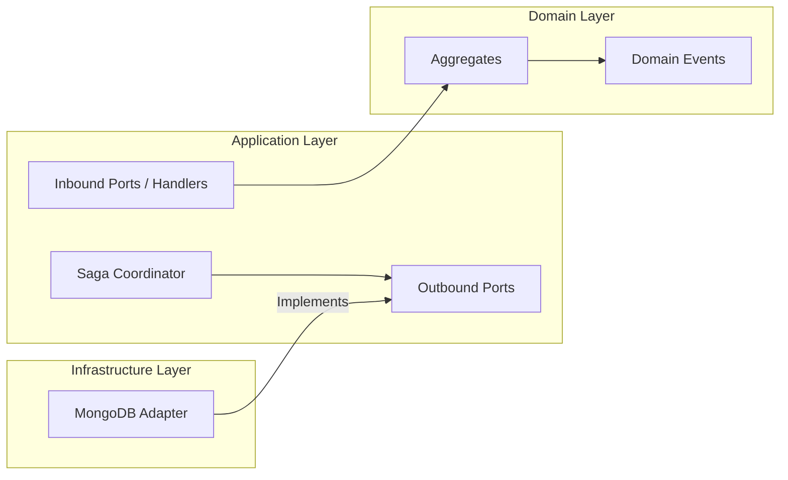
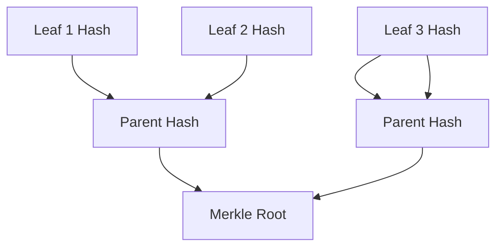
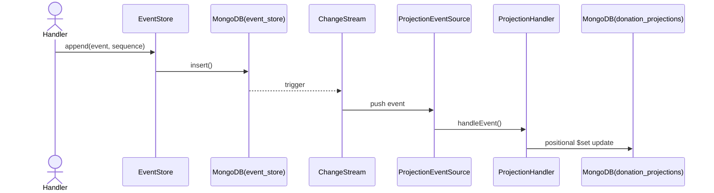

# Documentación Técnica — Sistema "Donaciones"

---

## 1. Visión General

El sistema **Donaciones** es una plataforma backend diseñada para garantizar la trazabilidad estricta y transparente de donaciones a lo largo de su ciclo de vida. Resuelve el problema de negocio de hacer auditable, inmutable y verificable el trayecto de los fondos donados y los activos físicos en los que se materializan (suministros, alimentos, medicina), desde el momento de la recepción financiera hasta su entrega final al beneficiario en escenarios humanitarios o de beneficencia.

El alcance del sistema abarca el núcleo (Core) que rige las reglas de negocio, la persistencia inmutable del historial, proyecciones optimizadas para consulta y un módulo criptográfico de anclaje de integridad.

A nivel técnico, el proyecto implementa un diseño robusto basado en **Domain-Driven Design (DDD)** táctico, **Arquitectura Hexagonal (Ports & Adapters)** y **Event Sourcing**, utilizando **MongoDB** como infraestructura de persistencia. Para asegurar que ningún actor pueda alterar la historia sin ser detectado, el sistema emplea mecanismos avanzados de integridad criptográfica, incluyendo canonicalización de esquemas JSON (RFC 8785) y construcción de árboles de Merkle. 

---

## 2. Arquitectura del Sistema

El sistema implementa una arquitectura rigurosa para separar las preocupaciones técnicas de la lógica pura del negocio.

### 2.1 Arquitectura Hexagonal

La arquitectura se divide en múltiples módulos y paquetes internos que emulan los anillos de la arquitectura de puertos y adaptadores:

- **Domain (`core.domain`)**: Contiene las invariantes del negocio, modelos de Aggregates, Value Objects y Domain Events. No tiene ninguna dependencia de frameworks, persistencia o infraestructura.
- **Application (`core.application`)**: Orquesta casos de uso, handlers de eventos, sagas (Outbox Pattern) y proyectores CQRS. Define los "Ports" (contratos de entrada y salida).
- **Contracts (`contracts`)**: Módulo de biblioteca compartida que define interfaces (Ports) y DTOs estables para ser consumidos por otros módulos aislados (como el módulo de IA o Crypto).
- **Adapters / Infrastructure (`core.infrastructure`)**: Implementaciones técnicas de los puertos (MongoDB Event Store, Proyecciones, serialización Jackson).



### 2.2 DDD (Domain-Driven Design)

El dominio está organizado principalmente en dos contextos o submódulos dentro del Core:

| Elemento | Ubicación | Responsabilidad | Evidencia | Estado |
| -------- | --------- | --------------- | --------- | ------ |
| **PhysicalAsset** | `core.domain.physicalasset` | Aggregate Root que gestiona la trazabilidad física, particiones (splits) y logística. | `PhysicalAsset.java` | ✅ Implementado |
| **Fund** | `core.domain.fund` | Aggregate Root que gestiona la trazabilidad financiera, reservas y reembolsos. | `Fund.java` | ✅ Implementado |
| **Domain Events** | `core.domain.*.payloads` | Hechos inmutables que representan transiciones de estado. | Clases terminadas en `Payload` | ✅ Implementado |
| **OutboxSaga** | `core.application.saga` | Coordinador Application Service que maneja la persistencia transaccional de eventos. | `OutboxSagaCoordinator.java` | ✅ Implementado |

### 2.3 Dependencias entre capas

| Capa | Puede depender de | No debería depender directamente de |
| ---- | ----------------- | ----------------------------------- |
| **Domain** | Sólo Java estándar | Application, Infrastructure, Librerías externas (Jackson, Spring, Mongo) |
| **Application** | Domain, Contracts | Infrastructure (excepto anotaciones Spring si se permite por convención) |
| **Infrastructure** | Application, Domain | - |
| **Crypto** | Contracts | Core |
| **AI** | Contracts | Core, Crypto |

**Observación**: La capa de dominio respeta puramente su aislamiento. Las dependencias externas (Jackson) se inyectan a nivel de adaptador (`EventCanonicalMapper`, `JcsHashAdapter`). 

---

## 3. Estructura del Proyecto

El sistema es un proyecto multi-módulo Maven:

| Ruta / Módulo | Responsabilidad | Tipo | Dependencias relevantes |
| ------------- | --------------- | ---- | ----------------------- |
| `/core` | Módulo principal con la lógica de dominio, CQRS, proyecciones e infraestructura MongoDB. | Módulo Maven | Spring Boot, MongoDB, Jackson |
| `/crypto` | Módulo aislado para hashing y Merkle Trees. | Módulo Maven | `java-json-canonicalization`, `web3j` |
| `/contracts` | Definición de DTOs y Puertos para integración entre módulos aislados (Ej: IA). | Módulo Maven | Ninguna externa |
| `/ai` | Módulo aislado (Aún en conceptualización/pruebas estructurales ArchUnit). | Módulo Maven | `spring-ai-bom` (Inferido) |

**Flujo de navegación recomendado para Onboarding:**
```text
Comando (External/Test)
   ↓
DonationProjectionHandler (Application)
   ↓
Fund / PhysicalAsset (Domain)
   ↓
TraceabilityEvent (Domain Event)
   ↓
MongoEventStoreAdapter (Infrastructure Adapter)
   ↓
MongoDB (Database)
```

---

## 4. Modelo de Dominio

### 4.1 PhysicalAsset

| Comando (Acción) | Precondiciones | Acción | Evento generado | Estado resultante |
| ---------------- | -------------- | ------ | --------------- | ----------------- |
| `register()` | Cantidad > 0, unidad de medida requerida | Valida campos iniciales | `ASSET_REGISTERED` | `REGISTERED` |
| `dispatch()` | Estado REGISTERED o RECEIVED, ubicación presente | Asigna transportista y borra ubicación actual | `ASSET_DISPATCHED` | `DISPATCHED` |
| `receive()` | Estado DISPATCHED | Registra nueva ubicación y receptor | `ASSET_RECEIVED` | `RECEIVED` |
| `split()` | Estado REGISTERED o RECEIVED, cantidad suficiente | Extrae cantidad para crear sub-activo | `ASSET_SPLIT`, (potencial `ASSET_DEPLETED`) | Mismo estado, o `DEPLETED` |
| `compensateSplit()` | Estado != DELIVERED | Reintegra cantidad extraída por rollback | `ASSET_SPLIT_COMPENSATED` | Restaura estado previo a depleción |
| `transferCustody()` | Estado no terminal | Cambia custodio sin cambiar ubicación | `ASSET_CUSTODY_TRANSFERRED` | Mismo estado |
| `deliver()` | Estado DISPATCHED o RECEIVED | Cierra ciclo de vida logístico | `ASSET_DELIVERED` | `DELIVERED` |

### 4.2 Fund

| Comando (Acción) | Precondiciones | Acción | Evento generado | Estado resultante |
| ---------------- | -------------- | ------ | --------------- | ----------------- |
| `registerFund()` | Pledged amount > 0 | Registra la intención de donación | `FUND_REGISTERED` | Creado |
| `clearFunds()` | Monto > 0 | Suma fondos líquidos | `FUNDS_CLEARED` | Aumento `clearedAmount` |
| `requestAllocation()`| Fondos disponibles suficientes | Reserva fondos | `ALLOCATION_REQUESTED` | Aumento `pendingAllocationAmount` |
| `confirmAllocation()`| Asignación activa existe | Consolida el gasto | `ALLOCATION_CONFIRMED` | Aumento `allocatedAmount` |
| `reverseAllocation()`| Asignación activa existe | Libera la reserva | `ALLOCATION_REVERSED` | Disminución `pendingAllocationAmount` |
| `refund()` | No exceder `clearedAmount` acumulado | Registra un reembolso. Si > disponible, marca `causedDeficit=true` | `FUNDS_REFUNDED` | Aumento `refundedAmount` |

### 4.3 Génesis

El evento de **Génesis** representa el momento fundacional de una cadena de trazabilidad.
Ocurre cuando se introduce dinero líquido real al sistema o se declara el compromiso financiero (Pledge). Fija las invariantes iniciales y genera el primer evento de la historia (Ej: `FUND_REGISTERED` o `FUNDS_CLEARED` inicial), proveyendo el anclaje criptográfico (previousHash = genesis hash o nulo).

### 4.4 Génesis Dual (ADR-016)

Documentado explícitamente en el código (`Fund.java:42`).
Este concepto arquitectónico resuelve el problema de tener dos orígenes válidos para fondos:
1. **Pledge primero**: `FUND_REGISTERED` actúa como génesis (promesa), seguido asíncronamente de un `FUNDS_CLEARED` (liquidación).
2. **Liquidación directa**: `clearFundsGenesis()` genera el `FUNDS_CLEARED` inicial directamente sin pasar por promesa previa, sirviendo simultáneamente como evento génesis.
Garantiza que la trazabilidad criptográfica siempre tenga un punto de inicio válido (root), sin importar el canal financiero de entrada.

---

## 5. Comandos y Casos de Uso (Inferidos de Pruebas y Servicios)

| Aggregate | Comando Lógico | Precondiciones | Regla de negocio | Evento | Efecto |
| --------- | -------------- | -------------- | ---------------- | ------ | ------ |
| Fund | Crear Donación | Monto > 0 | No permite registro negativo | `FUND_REGISTERED` | Entidad Fund creada |
| PhysicalAsset | Partir Lote | Cantidad requerida < Cantidad actual | Protege de sobregiros | `ASSET_SPLIT` | Cantidad reducida, se puede crear nuevo hijo |
| PhysicalAsset | Rollback Partición | Activo original no Delivered | Si la creación del hijo falla en SAGA, se compensa el padre | `ASSET_SPLIT_COMPENSATED` | Fondos/Lote devueltos |

---

## 6. Event Sourcing

### 6.1 Event Store
Implementado de forma nativa en **MongoDB** (`MongoEventStoreAdapter`).
- **Persistencia**: Los eventos se guardan en la colección `event_store` representados por `TraceabilityEventDocument`.
- **Identificador**: `streamId` (el ID del Aggregate).
- **Versión**: Mantenido con un campo estricto `sequence`. Posee un índice único compuesto `{streamId: 1, sequence: 1}` para garantizar el control de concurrencia optimista (Optimistic Locking).
- **Serialización**: El payload del dominio se mapea a un `Map<String, Object>` genérico para su flexibilidad y validación criptográfica, acompañado de su `schemaVersion`.

### 6.2 Reconstitución del Aggregate
```text
MongoDB Collection (event_store)
     ↓
MongoEventStoreAdapter.loadStream(streamId)
     ↓
List<TraceabilityEvent> (sorted by sequence ASC)
     ↓
PhysicalAsset.rehydrate(...) / Fund.rehydrate(...)
     ↓
Estado actual validado en memoria
```

### 6.3 Consistencia y concurrencia
- **Optimistic Concurrency**: ✅ Implementado. Garantizado por el índice único compuesto en MongoDB. Si dos hilos intentan escribir la versión `5`, la base de datos rechaza la segunda con una excepción (que se convierte en `ConcurrencyConflictException`).
- **Event Ordering**: ✅ Implementado y validado en tests de proyecciones CQRS.
- **Idempotencia CQRS**: ✅ Implementada en los handlers (Ej: `DonationProjectionHandler`) usando una lógica `incomingSequence <= lastProcessed` para rechazar entregas duplicadas de Change Streams.

---

## 7. Trazabilidad

La historia completa de un activo se puede recuperar consultando todos los eventos de su `streamId`. El sistema garantiza el linaje. Por ejemplo, en un `ASSET_SPLIT`, el payload almacena:
- `childAssetId`
- `rootAssetRef` (para conocer el inicio absoluto de la cadena logística)
- `parentAssetRef`
Esta referencialidad cruzada en eventos inmutables permite modelar grafos logísticos complejos sin perder el rastro del dinero u origen de los insumos. Modificar la base de datos invalida los enlaces criptográficos (`previousHash`).

---

## 8. Criptografía e Integridad

### 8.1 JSON Canonicalization (RFC 8785)
El sistema utiliza el estándar **JCS** (a través de la librería `java-json-canonicalization`) para resolver la no-determinicidad de la serialización JSON (ordenamiento de llaves, espacios en blanco).
- **Responsabilidad**: `JcsHashAdapter` en el módulo `crypto`.
- **Proceso**:
```text
Map<String, Object> (Payload en Java)
      ↓
String JSON sucio (Jackson)
      ↓
JCS / RFC 8785 (JsonCanonicalizer)
      ↓
Representación JSON Canónica (Llaves ordenadas lexicográficamente)
      ↓
SHA-256 Hash
```

### 8.2 Hashing
- **Algoritmo**: SHA-256 (`MessageDigest.getInstance("SHA-256")`).
- **Salida**: Hexadecimal en minúsculas.
- **Inyección**: Se inyecta la llave `"previousHash"` en el mapa antes de canonicalizar para vincular la cadena.

### 8.3 Merkle Tree
Implementado en `MerkleTree.java`.
Agrupa lotes de eventos (hashes) construyendo un árbol binario.
Si un nivel tiene número impar de hojas, el último hash se duplica y se hashea consigo mismo.


### 8.4 Modelo de integridad
- ✅ **Inmutabilidad de cadena de eventos** (vía hashes encadenados).
- ✅ **Determinismo de Serialización** (vía RFC 8785).
- ✅ **Anclaje Blockchain (Web3j)**: Los Merkle Roots se asientan de manera determinista y con resiliencia de red (Poller/Scheduler) en la red Polygon/Ganache, lo que provee inmutabilidad distribuida.
- ❓ **No Repudio / Autenticidad**: No se evidencia uso de firmas asimétricas (RSA/ECC) para firmar criptográficamente el origen.

---

## 9. ADRs y Decisiones Arquitectónicas

| ID | Decisión Inferida / Mencionada | Evidencia |
| -- | ------------------------------ | --------- |
| **ADR-004** | Validaciones financieras (FUNDS_REFUNDED no excede cleared). | `Fund.java:114` |
| **ADR-010** | Mecanismo común de Idempotencia, Orden y Cuarentena CQRS. | Múltiples referencias en Handlers CQRS |
| **ADR-015** | Aislamiento del módulo AI consumiendo sólo DTOs deterministas. | `AuditFactsDTO.java`, `ai/` module |
| **ADR-016** | Dual Genesis: Soporte para pledge financiero o liquidación directa como raíz. | `Fund.java:42` |

---

## 10. Persistencia y MongoDB

- **event_store**: Almacena transacciones inmutables de ES. Contiene `previousHash` y `eventHash`. Indexado por `{streamId, sequence}`.
- **donation_projections**: Materialized View rápida del estado actual para interfaz de usuario.
- **projection_checkpoints**: Almacena los `resumeToken` de los Change Streams de MongoDB (reconstrucción histórica + real-time CQRS).
- **projection_retry_pending**: Sistema de cuarentena (DLQ) para eventos que llegaron fuera de orden o sin sus dependencias.

---

## 11. Testing

| Tipo | Tecnología | Objetivo | Evidencia |
| ---- | ---------- | -------- | --------- |
| **Arquitectura** | ArchUnit | Validar hexágono en módulos AI y Crypto | `ArchitectureTest.java` |
| **Unitarios** | JUnit 5 | Validar criptografía pura (Merkle, JCS) | `JcsHashAdapterTest.java` |
| **Integración CQRS** | Testcontainers / Mongo | Validar el funcionamiento de Change Streams, Idempotencia y Replay concurrente | `DonationProjectionIntegrationTest.java` |

---

## 12. Testcontainers y entorno de ejecución

### Requisitos
- **Java**: Versión 21 (Declarado en `pom.xml`).
- **Maven**: 3.x+
- **Docker**: Requerido localmente para ejecutar Testcontainers (MongoDB).
- **Spring Boot**: 3.4.4

### Ejecución
```bash
./mvnw clean test
```

### Problemas potenciales con Docker/Testcontainers
Si se experimentan fallos como `MongoSocketReadException` o "connection refused", verifique:
1. **Docker Daemon en ejecución**: En sistemas Linux/Mac verificar permisos de `/var/run/docker.sock`.
2. **Recomendación Local**: Asignar permisos correctos (`sudo chmod 666 /var/run/docker.sock`) temporalmente o pertenecer al grupo `docker`.
3. **Alternativa CI/CD**: Para entornos donde Docker In Docker no sea viable, configurar Testcontainers Cloud o provisionar una imagen temporal embebida (como flapdoodle, aunque está deprecado).

---

## 13. Flujos principales

### Event Sourcing + CQRS Asíncrono


---

## 14. Observaciones Arquitectónicas

| Severidad | Área | Problema | Evidencia | Impacto | Recomendación |
| --------- | ---- | -------- | --------- | ------- | ------------- |
| 🟡 Medio | **CQRS** | Acoplamiento del RetryScheduler | `ProjectionRetryScheduler` llama explícitamente a `DonationProjectionHandler` | Si se introducen nuevas proyecciones (Ej: `AuditFacts`), el scheduler no sabrá a cuál enrutar el reintento. | Agregar un campo `handlerName` al documento de cuarentena y extraer una interfaz común (ver Tarea 11 planeada). |
| 🔵 Mejora | **Crypto** | Algoritmo Hash quemado | `JcsHashAdapter` invoca directamente `MessageDigest.getInstance("SHA-256")` | Dificultad de rotar algoritmos criptográficos a futuro. | Inyectar la variante de digestión por configuración. |

---

## 15. Glosario del Dominio

| Término | Definición | Contexto |
| ------- | ---------- | -------- |
| **Fund** | Monto de ayuda financiera asignado a una iniciativa. | Financiero / Inicialización |
| **PhysicalAsset** | Bien físico tangible sujeto a trazabilidad logística. | Logística de Última Milla |
| **Split (Partición)**| Acción de desarmar un lote grande en unidades más pequeñas, creando activos hijos. | Logística / Centros de acopio |
| **Idempotencia** | Garantía matemática de que procesar un mensaje repetido no alterará el estado. | CQRS / Change Streams |
| **Resume Token** | Puntero transaccional de MongoDB que marca dónde quedó el cursor de lectura asíncrona. | Reconstrucción Proyecciones |

---

## 16. Resumen Ejecutivo Final

| Área | Estado | Confianza | Observación |
| ---- | ------ | --------- | ----------- |
| Arquitectura (Ports/Adapters) | ✅ Confirmado | Alta | Limpieza estricta de dominios observada. |
| DDD | ✅ Confirmado | Alta | Uso profundo de Invariantes y Eventos. |
| Event Sourcing | ✅ Confirmado | Alta | Base sólida y probada, concurrencia manejada (secuencias). |
| Trazabilidad | ✅ Confirmado | Alta | Árbol genealógico preservado en `rootAssetRef` y `parentAssetRef`. |
| Criptografía | ✅ Confirmado | Alta | Implementación fiel a RFC 8785 con JCS y Árboles de Merkle. |
| Blockchain | ✅ Confirmado | Alta | Motor Web3j robusto con separación de fallos, scheduler aislado y Poller de on-chain receipts en verde. |
| CQRS | ✅ Confirmado | Alta | Refactorizado para ser genérico (`ProjectionEventHandler`), soportando proyecciones independientes (`DonationProjection` y `AuditFacts`). |
| Testing (Testcontainers) | ✅ Confirmado | Alta | Las pruebas reales demostraron encontrar bugs genuinos, se cuenta con test End-to-End validado contra Ganache. |
| AI | ✅ Confirmado | Alta | Integración con Spring AI probada con TTL y Circuit Breakers para aislamiento resiliente. |

## 17. Información Faltante

Para hacer este documento más robusto, se requeriría evidencia de:
- El `application.yml` o configuración base de propiedades.
- Las implementaciones concretas de la capa de API (Adaptadores HTTP REST/GraphQL).
- Información sobre si existen sistemas de autenticación y autorización o esquemas de firma digital (PKI) de los orígenes de las transacciones.
- El cuerpo interno del módulo SAGA (`OutboxSagaCoordinator.java`), que dicta la transaccionalidad entre el EventStore y Outbox.
